```mermaid
flowchart TD
    Start([User Opens App<br/>First Time]) --> ViewDashboard[View Dashboard<br/>Progress Rings Empty]
    ViewDashboard --> TapLogMeal[Tap 'Log Meal' Button]
    TapLogMeal --> ConversationModal[Conversation Modal Opens<br/>System: 'What did you eat?']
    
    ConversationModal --> UserTypes[User Types Meal Description<br/>'3 eggs, chicken, vegetables']
    UserTypes --> SystemSuggests{System Checks<br/>Database}
    
    SystemSuggests -->|No Match| ManualEntry[Manual Entry Mode<br/>User enters ingredients]
    SystemSuggests -->|Partial Match| ShowSuggestions[Show Suggestions<br/>Frequency-weighted]
    
    ManualEntry --> EnterIngredient1[Enter Ingredient 1<br/>'3 eggs - 180g']
    EnterIngredient1 --> SetConfidence1[Set Confidence: High<br/>User measured precisely]
    SetConfidence1 --> EnterIngredient2[Enter Ingredient 2<br/>'100g raw chicken breast']
    EnterIngredient2 --> SetConfidence2[Set Confidence: High]
    SetConfidence2 --> EnterIngredient3[Enter Ingredient 3<br/>'Roasted vegetables']
    
    EnterIngredient3 --> UncertainIngredient{Uncertain<br/>Ingredients?}
    UncertainIngredient -->|Yes| DescribeMeal[User Describes:<br/>'100g raw potatoes + 10g olive oil<br/>cooked in oven']
    UncertainIngredient -->|No| ConfirmMeal[Confirm Meal Entry]
    
    DescribeMeal --> LLMOffer[System Offers:<br/>'I can help estimate macros.<br/>Calculate?']
    LLMOffer --> UserAccepts{User Accepts?}
    UserAccepts -->|Yes| LLMProcess[LLM Agent Processes<br/>Returns Estimate + Confidence]
    UserAccepts -->|No| ManualEstimate[User Enters Manual Estimate]
    
    LLMProcess --> ShowEstimate[Show Estimate:<br/>Macros + Confidence: Medium<br/>Suggestion: 'Add potato type for accuracy']
    ShowEstimate --> UserRefines{User Refines?}
    UserRefines -->|Yes| AddDetails[User Adds: 'Russet potatoes']
    UserRefines -->|No| AcceptEstimate[Accept Estimate]
    
    AddDetails --> LLMRefine[LLM Refines Estimate<br/>Confidence: Medium-High]
    LLMRefine --> AcceptEstimate
    ManualEstimate --> AcceptEstimate
    
    AcceptEstimate --> ConfirmMeal
    ConfirmMeal --> SaveMeal[Save Meal Entry]
    SaveMeal --> UpdateProgress[Update Progress Rings<br/>Animate Fill]
    UpdateProgress --> AddTimeline[Add to Timeline<br/>With Time Stamp]
    AddTimeline --> SystemLearns[System Learns:<br/>- Meal pattern<br/>- Ingredients<br/>- Cooking method]
    SystemLearns --> Success[Success!<br/>Meal Logged]
    
    ShowSuggestions --> UserSelects[User Selects Suggestion]
    UserSelects --> ConfirmMeal
    
    Success --> Day3[Day 3: User Opens App]
    Day3 --> SystemRemembers[System Proactively Suggests:<br/>'3 eggs, chicken, roasted vegetables']
    SystemRemembers --> OneTap[User Taps 'Log It'<br/>5 seconds total]
    OneTap --> Success
    
    style Start fill:#E2E8F0
    style Success fill:#48BB78
    style LLMProcess fill:#4299E1
    style SystemLearns fill:#00B4A6
```

```mermaid
flowchart TD
    Start([User at Restaurant<br/>Opens App]) --> ViewDashboard[View Dashboard<br/>Current Progress]
    ViewDashboard --> TapLogMeal[Tap 'Log Meal' Button]
    TapLogMeal --> ConversationModal[Conversation Modal Opens]
    
    ConversationModal --> UserDescribes[User Types:<br/>'Grilled red meat, looks like 200g,<br/>medium fat, with roasted vegetables']
    UserDescribes --> SystemDetects{System Detects<br/>Uncertainty?}
    
    SystemDetects -->|Yes| LLMOffer[System Offers:<br/>'I can help estimate this meal.<br/>Would you like me to calculate?']
    SystemDetects -->|No| CheckDatabase[Check Database<br/>for Similar Meals]
    
    LLMOffer --> UserAccepts{User Accepts?}
    UserAccepts -->|Yes| LLMProcess[LLM Agent Processes:<br/>- Identifies likely cut<br/>- Estimates portion<br/>- Accounts for cooking method]
    UserAccepts -->|No| ManualEntry[Manual Entry Mode]
    
    LLMProcess --> ShowEstimate[Show Estimate:<br/>- Steak: ~200g, sirloin/strip<br/>- Estimated macros<br/>- Confidence: Low-Medium]
    ShowEstimate --> ShowSuggestions[Show Suggestions:<br/>'Ask restaurant about cut'<br/>'Estimate portion more precisely']
    
    ShowSuggestions --> UserDecision{User Decision}
    UserDecision -->|Accept Estimate| AcceptLowConf[Accept with Low Confidence<br/>Mark as 'Estimated']
    UserDecision -->|Refine Now| AddDetails[User Adds Details<br/>If Available]
    UserDecision -->|Skip| Cancel[Cancel Entry]
    
    AddDetails --> LLMRefine[LLM Refines Estimate<br/>Confidence Improves]
    LLMRefine --> AcceptEstimate[Accept Estimate]
    
    AcceptLowConf --> SaveMeal[Save Meal Entry<br/>Marked: Low Confidence]
    AcceptEstimate --> SaveMeal
    
    SaveMeal --> UpdateProgress[Update Progress Rings<br/>Show Confidence Indicator]
    UpdateProgress --> AddTimeline[Add to Timeline<br/>With 'Estimated' Badge]
    AddTimeline --> SystemLearns[System Learns:<br/>- Restaurant meal pattern<br/>- Uncertainty handling<br/>- User acceptance of estimates]
    SystemLearns --> Success[Success!<br/>Tracking Continues]
    
    CheckDatabase -->|Match Found| ShowSimilar[Show Similar Meals<br/>From Database]
    CheckDatabase -->|No Match| LLMOffer
    ShowSimilar --> UserSelects[User Selects or Edits]
    UserSelects --> SaveMeal
    
    ManualEntry --> SaveMeal
    Cancel --> ViewDashboard
    
    Success --> Later[Later: User Returns<br/>to Same Restaurant]
    Later --> FindPrevious[Find Previous Entry<br/>in Timeline]
    FindPrevious --> EditEntry[Edit Entry:<br/>Add 'Ribeye steak']
    EditEntry --> SystemUpdates[System Updates:<br/>- Improves confidence<br/>- Refines macros<br/>- Learns correction]
    SystemUpdates --> Success
    
    style Start fill:#E2E8F0
    style Success fill:#48BB78
    style LLMProcess fill:#4299E1
    style AcceptLowConf fill:#ED8936
    style SystemLearns fill:#00B4A6
```

# UX Design Specification nutri_app

**Author:** Paul
**Date:** 2026-02-03-103325

---

## Executive Summary

### Project Vision

**nutri_app** is a learning-first nutrition tracking webapp designed to eliminate the friction that causes people to abandon macro tracking. The core innovation is a system that learns from each interaction, progressively building a personalized ingredient and meal database that makes tracking effortless over time.

**Primary Goal:** Help users understand their consumption and assess whether they need to make adjustments to reach their macro goals, without the manual, boring, forgettable experience that makes tracking feel like a chore.

**Success Vision:** Users can log meals in 5-10 seconds (learned meals) or 1 second (habits), build a coherent database progressively without noticing, and make informed decisions about their nutrition plan based on clear visual feedback.

### Target Users

**Primary User: The Goal-Driven Macro Tracker**

- **Profile:** Fitness enthusiast with a consistent diet who understands macro tracking and wants to track regularly
- **Tech Comfort:** Comfortable with phone and web browsing
- **Devices:** Primarily phone and laptop
- **Context:** Actively manages nutrition as part of a strategic approach to fitness goals
- **Pain Points:**
  - Manual, boring data entry that feels like a chore
  - Forgetting to track because it's not integrated naturally into routine
  - Repetitive entry of the same meals without system learning
  - Difficulty assessing consumption and knowing when adjustments are needed

**Usage Patterns:**
- **Real-time tracking:** Around meal time (immediately after eating)
- **Batch planning:** Start of day (plan meals for the day) or start of week (plan meals for the week)
- **Flexible timing:** Users may switch between real-time and batch planning based on their schedule

### Key Design Challenges

**1. Eliminating Manual, Boring Data Entry**
- Challenge: Make tracking feel natural and effortless, not like tedious data entry
- Impact: Users abandon tracking when it feels like work
- UX Focus: Conversation-style input, smart suggestions, one-tap logging for learned habits

**2. Supporting Flexible Timing Patterns**
- Challenge: Accommodate both real-time tracking (around meals) and batch planning (start of day/week)
- Impact: Users have different planning styles and schedules
- UX Focus: Seamless transition between real-time logging and batch planning interfaces

**3. Cross-Device Consistency**
- Challenge: Provide seamless experience across phone and laptop
- Impact: Users switch devices based on context (phone for quick logging, laptop for planning)
- UX Focus: Responsive design, consistent interactions, data sync across devices

**4. Preventing Forgettability**
- Challenge: Make tracking feel natural and integrated, not a task to remember
- Impact: Users forget to track when it feels like an extra chore
- UX Focus: Proactive suggestions, contextual prompts, visual reminders that feel helpful, not pushy

**5. Clear Consumption Assessment**
- Challenge: Help users quickly understand their consumption and assess if adjustments are needed
- Impact: Users need to make data-driven decisions about their nutrition plan
- UX Focus: Visual progress indicators, clear summaries, intuitive comparison to goals

### Design Opportunities

**1. Conversation-Style Input**
- Opportunity: Natural language input feels less like data entry and more like communication
- Impact: Reduces friction, makes tracking feel natural and effortless
- UX Approach: Chat-like interface for meal logging, LLM agent for uncertain ingredients

**2. Batch Planning Interface**
- Opportunity: Support users who plan meals in advance (start of day/week)
- Impact: Reduces decision fatigue, makes tracking feel proactive rather than reactive
- UX Approach: Calendar view, meal planning interface, drag-and-drop meal assignment

**3. Smart Suggestions and Learning**
- Opportunity: System learns patterns and suggests meals/ingredients before user finishes typing
- Impact: Reduces manual work dramatically, makes tracking feel effortless
- UX Approach: Frequency-weighted autocomplete, proactive meal suggestions, one-tap logging for habits

**4. Visual Assessment Dashboard**
- Opportunity: Make consumption and adjustment needs obvious at a glance
- Impact: Users can quickly assess whether they're on track and what adjustments are needed
- UX Approach: Circular progress rings, color-coded indicators, clear goal comparison

**5. Invisible Learning System**
- Opportunity: Build personalized database in background without user noticing
- Impact: Users realize they have a comprehensive database that "just appeared"
- UX Approach: Progressive learning, pattern recognition, seamless database building

**6. Contextual, Non-Intrusive Reminders**
- Opportunity: Help users remember to track without feeling pushy or annoying
- Impact: Reduces forgettability while maintaining natural, effortless experience
- UX Approach: Smart prompts based on meal timing patterns, visual cues, optional gentle reminders

## Core User Experience

### 2.1 Defining Experience

**The Defining Interaction: "Log Meals Effortlessly with Smart Suggestions"**

The core experience that defines nutri_app is effortless meal logging with intelligent suggestions that improve over time. This single interaction, when executed perfectly, makes everything else follow - users see progress, feel accomplished, and want to continue using the product.

**User Description:** "I just type a few letters and it suggests my meal. One tap and I'm done. It remembers everything I eat."

**The Magic Moment:** When users realize they can log a frequently eaten meal in 1 second (one tap) or a learned meal in 5-10 seconds, and the system gets smarter every time they use it.

**If We Nail This:** Users will feel accomplished, confident, and motivated. They'll build a comprehensive database without noticing. They'll tell friends about how easy tracking has become.

**If We Fail This:** Users will feel frustrated, confused, and abandon tracking. The learning system won't demonstrate value. The product becomes just another annoying tracking app.

**Core Experience Loop:**
1. User logs a meal (real-time or batch planning)
2. System learns from the entry
3. System suggests improvements and remembers patterns
4. Next time, logging is faster and easier
5. User sees progress toward goals
6. User makes informed adjustments

**Success Metric:** Meal logging time reduces from minutes (first time) to 5-10 seconds (learned meals) to 1 second (habits).

### 2.2 User Mental Model

**Current Mental Model:**
- Users expect traditional form-based data entry
- They're used to searching through databases
- They expect repetitive work (same meal = same effort every time)
- They anticipate friction and accept it as normal

**What We're Changing:**
- From: Form-based data entry → To: Conversation-style natural input
- From: Searching databases → To: Smart suggestions based on personal patterns
- From: Repetitive work → To: Progressive learning that gets easier
- From: Accepting friction → To: Effortless experience

**User Expectations:**
- **Speed:** Users expect it to be slow, but we'll make it fast
- **Learning:** Users don't expect systems to learn, but we'll demonstrate it quickly
- **Personalization:** Users expect generic databases, but we'll build personal ones
- **Effort:** Users expect work, but we'll make it effortless

**Where Confusion/Frustration Occurs:**
- **Too many options:** Cluttered interface with too many features
- **Unclear interface:** Not knowing what to do or where to start
- **System not learning:** Suggestions don't improve, feels like wasted effort
- **Uncertainty handling:** Not knowing how to log uncertain ingredients

**Mental Model Transition:**
- **Week 1:** Users learn the system remembers and suggests
- **Week 2:** Users trust the system and rely on suggestions
- **Week 4:** Users expect the system to know their patterns (mental model shifts)

### 2.3 Success Criteria

**What Makes Users Say "This Just Works":**
- System suggests correct meal within 3 interactions for frequently eaten meals
- Meal logging takes 5-10 seconds for learned meals, 1 second for habits
- System demonstrates learning quickly (within first week)
- Suggestions are accurate and helpful, not annoying

**When Users Feel Smart or Accomplished:**
- Logging a meal takes seconds instead of minutes
- System remembers their patterns accurately
- They see clear progress toward their goals
- They realize they've built a comprehensive database without noticing

**Feedback That Tells Users They're Succeeding:**
- Quick visual confirmation when meal is logged
- Progress indicators update immediately
- Suggestions appear accurately and quickly
- System demonstrates learning (suggestions improve over time)

**Speed Requirements:**
- **New meals:** Acceptable time (user understands it takes time for new ingredients)
- **Learned meals:** 5-10 seconds from start to finish
- **Habits:** 1 second (one-tap confirmation)
- **Autocomplete:** Suggestions appear within 200ms of typing

**What Should Happen Automatically:**
- System learns meal patterns and frequency
- System remembers ingredients and portion preferences
- System suggests meals before user finishes typing
- System builds database in background without user awareness
- System improves suggestions based on user corrections

**Success Indicators:**
- User reports meal logging is "effortless" and "enjoyable"
- Data entry time reduced by 60%+ after 1 week
- User corrections decrease over time (system learning works)
- User keeps using it for 1 month without feeling burdened
- User reports "feels like it knows me"

### 2.4 Novel UX Patterns

**Established Patterns We're Using:**
- **Forms and Input Fields:** Familiar data entry patterns
- **Autocomplete:** Users understand typing and selecting from suggestions
- **Progress Indicators:** Users understand visual progress (rings, bars)
- **Cards and Lists:** Familiar patterns for displaying meals

**Novel Patterns We're Introducing:**
- **Learning-First Architecture:** System learns and improves automatically (not just remembering)
- **Conversation-Style Input:** Natural language input feels like talking, not data entry
- **Invisible Database Building:** Database builds in background without user awareness
- **Progressive Enhancement:** Experience gets better over time, not static
- **Confidence-Aware Tracking:** Explicit confidence levels for data quality

**Combination Approach:**
- **Familiar Foundation:** Use established patterns (forms, autocomplete) so users understand immediately
- **Novel Enhancement:** Add learning and conversation-style on top of familiar patterns
- **Progressive Revelation:** Start with familiar, reveal novel capabilities as system learns

**Teaching Novel Patterns:**
- **No Explicit Teaching Needed:** Learning system works invisibly, users discover it naturally
- **Visual Feedback:** Show system learning through improved suggestions
- **Metaphors:** "The system remembers" (familiar concept) + "gets smarter" (novel enhancement)
- **Discovery:** Users discover novel features through use, not tutorials

**Unique Twist on Established Patterns:**
- **Autocomplete:** Not just search - frequency-weighted, learns from patterns
- **Forms:** Not just data entry - conversation-style, natural language support
- **Progress Indicators:** Not just numbers - confidence-aware, learning-enhanced
- **Suggestions:** Not just recent items - pattern-based, proactive, contextual

### 2.5 Experience Mechanics

**Core Experience Flow: Meal Logging**

**1. Initiation:**
- **Trigger:** User opens app or taps "Log Meal" button
- **Context:** User has just eaten (real-time) or planning meals (batch)
- **Entry Point:** Primary action button prominently displayed, or proactive suggestion for learned habits
- **Invitation:** Clean interface invites action, no overwhelming options

**2. Interaction:**

**Scenario A: Learned Habit (1 second)**
- User opens app
- System proactively suggests: "Log your usual breakfast? (3 eggs, 100g chicken, roasted vegetables)"
- User taps "Yes"
- **Done** - Meal logged, progress updated

**Scenario B: Learned Meal (5-10 seconds)**
- User starts typing meal name: "ch"
- System suggests: "Chicken and rice" (most frequently eaten)
- User selects suggestion
- System suggests complete meal with ingredients and macros
- User confirms or edits
- **Done** - Meal logged, progress updated, system learns from any edits

**Scenario C: New Meal with Uncertain Ingredients (Variable time)**
- User types: "100g raw potatoes + 10g olive oil cooked in oven"
- System offers: "I can help estimate the macros. Would you like me to calculate?"
- User confirms
- LLM agent processes and returns estimated macros with confidence level
- User accepts or refines
- **Done** - Meal logged, system learns cooking method and ingredient combination

**3. Feedback:**
- **Immediate:** Visual confirmation when meal is logged (checkmark, animation)
- **Progress Update:** Circular progress rings update in real-time showing macro progress
- **Learning Demonstration:** System shows it learned (suggestions improve next time)
- **Error Handling:** Clear guidance if something goes wrong, helpful recovery paths

**4. Completion:**
- **Success State:** Meal logged, progress updated, user sees accomplishment
- **Next Action:** User can log another meal, view progress, or close app
- **System Learning:** Database updated, patterns recognized, suggestions improved
- **User Feeling:** Accomplished, confident, motivated to continue

**Interaction Details:**

**Input Methods:**
- **Typing:** Natural language or structured input
- **Selection:** Tap suggestions from autocomplete
- **Confirmation:** One-tap for learned habits
- **Refinement:** Edit suggested meals/ingredients

**System Responses:**
- **Suggestions:** Appear within 200ms of typing
- **LLM Processing:** Complete within 5 seconds
- **Learning:** Happens invisibly in background
- **Progress Updates:** Real-time visual feedback

**Error States:**
- **Uncertain Ingredients:** LLM agent handles gracefully, provides estimates
- **Network Issues:** Clear error message, retry option, data saved locally
- **Incorrect Suggestions:** Easy correction, system learns from corrections
- **Confusion:** Helpful guidance, contextual hints, clear next steps

### Platform Strategy

**MVP Platform: Web App (PWA)**
- **Primary Platform:** Progressive Web App accessible via web browser
- **Device Support:** Responsive design for both phone and laptop
- **Interaction Methods:**
  - Touch-based on mobile devices (large touch targets, swipe gestures)
  - Mouse/keyboard on desktop (hover states, keyboard shortcuts)
- **Connectivity:** Online-only for MVP (no offline mode)
- **Future:** Native iOS and Android apps post-MVP

**Cross-Device Experience:**
- Seamless data sync across devices
- Consistent interface and interactions regardless of device
- Context-appropriate optimizations (quick logging on phone, planning on laptop)
- Responsive design that adapts to screen size without losing functionality

### Effortless Interactions

**1. One-Tap Logging for Learned Habits**
- **Interaction:** User taps once to log frequently eaten meals
- **Effort Level:** Zero thought required
- **Example:** "3 eggs everyday" = one tap confirmation
- **Timing:** 1 second from open to logged

**2. Smart Suggestions Before Typing**
- **Interaction:** System proactively suggests meals based on patterns
- **Effort Level:** Minimal - user just confirms
- **Example:** System suggests "Log your usual breakfast?" before user starts typing
- **Timing:** Suggestions appear instantly based on learned patterns

**3. Frequency-Weighted Autocomplete**
- **Interaction:** Autocomplete suggests most-used items first as user types
- **Effort Level:** Minimal typing required
- **Example:** Typing "ch" suggests "chicken breast" (most used) before "chickpeas"
- **Timing:** Suggestions appear within 200ms of typing

**4. LLM Agent for Uncertain Ingredients**
- **Interaction:** User describes meal in natural language, system estimates macros
- **Effort Level:** Natural conversation, no technical knowledge needed
- **Example:** "100g raw potatoes + 10g olive oil cooked in oven" → system estimates macros
- **Timing:** Response within 5 seconds

**5. Invisible Database Building**
- **Interaction:** System learns and builds database automatically in background
- **Effort Level:** Zero - happens without user awareness
- **Example:** User logs meals, system builds ingredient/meal database progressively
- **Timing:** Continuous, invisible learning

**6. Seamless Real-Time to Batch Planning Transition**
- **Interaction:** User can switch between logging immediately or planning ahead
- **Effort Level:** Natural flow, no mode switching friction
- **Example:** User can log meal now or plan meals for the day/week
- **Timing:** Instant transition between modes

### Critical Success Moments

**1. Day 3: The Learning Moment (Surprise)**
- **Moment:** System remembers and suggests accurately after just a few entries
- **User Reaction:** "Wow, it remembered everything!"
- **Emotional Arc:** Frustration → Surprise → Delight
- **UX Requirement:** System must demonstrate learning quickly (within 3 interactions for frequently eaten meals)
- **Design Focus:** Clear visual feedback showing system has learned, accurate suggestions

**2. Week 1: The Effortless Moment (Delight)**
- **Moment:** Tracking becomes effortless, no longer annoying
- **User Reaction:** "This doesn't feel like work anymore"
- **Emotional Arc:** Determined → Relief → Delight
- **UX Requirement:** Meal logging time reduced by 60%+ after 1 week
- **Design Focus:** Smooth interactions, smart suggestions, visual progress that motivates

**3. Week 4: The Realization Moment (Pride)**
- **Moment:** User realizes they have a comprehensive database that "just appeared"
- **User Reaction:** "I didn't build this database - it just appeared!"
- **Emotional Arc:** Effortless → Surprise → Pride → Satisfaction
- **UX Requirement:** Database convergence to stable state, comprehensive meal/ingredient library
- **Design Focus:** Visual database overview, pattern recognition insights, celebration of progress

**4. First-Time User Success**
- **Moment:** User successfully logs first meal with LLM agent help
- **User Reaction:** "This actually works, even with uncertain ingredients"
- **Emotional Arc:** Anxiety → Relief → Confidence
- **UX Requirement:** LLM agent handles uncertainty gracefully, provides helpful estimates
- **Design Focus:** Clear guidance, confidence levels, helpful suggestions

**5. Exception Handling Success**
- **Moment:** User tracks meal at restaurant with uncertain ingredients
- **User Reaction:** "I didn't have to skip tracking - the system handled it"
- **Emotional Arc:** Anxiety → Relief → Empowerment
- **UX Requirement:** System handles uncertainty without blocking progress
- **Design Focus:** Graceful error handling, confidence tracking, refinement workflow

### Experience Principles

**1. Effortless Meal Logging**
- **Principle:** The core action (meal logging) must feel natural and require zero thought
- **Application:** One-tap logging for habits, smart suggestions, conversation-style input
- **Measure:** Meal logging time: 1 second (habits), 5-10 seconds (learned), acceptable (new)

**2. Invisible Learning**
- **Principle:** System learns and improves in background without user awareness
- **Application:** Progressive database building, pattern recognition, automatic suggestion improvement
- **Measure:** User reports "didn't realize I was building this database"

**3. Natural Interaction**
- **Principle:** Interactions feel like conversation, not data entry
- **Application:** Natural language input, LLM agent assistance, chat-like interface
- **Measure:** User reports tracking feels "natural" and "effortless"

**4. Progressive Enhancement**
- **Principle:** Experience gets better over time as system learns user patterns
- **Application:** Suggestions improve, logging gets faster, database becomes more accurate
- **Measure:** Data entry time reduced by 60%+ after 1 week, corrections decrease over time

**5. Flexible Timing**
- **Principle:** Support both real-time tracking and batch planning seamlessly
- **Application:** Seamless transition between modes, calendar view for planning, quick logging for real-time
- **Measure:** Users can switch between modes without friction, both patterns feel natural

**6. Clear Assessment**
- **Principle:** Users can quickly understand consumption and assess if adjustments are needed
- **Application:** Visual progress indicators, clear summaries, intuitive goal comparison
- **Measure:** Users can "read summaries clearly and make better plan choices"

**7. Non-Intrusive Guidance**
- **Principle:** Help users without feeling pushy or annoying
- **Application:** Contextual prompts, visual cues, optional gentle reminders
- **Measure:** Users don't feel nagged, but tracking doesn't feel forgettable

## Desired Emotional Response

### Primary Emotional Goals

**1. Accomplishment**
- **Goal:** Users feel accomplished when they successfully track meals and see progress
- **Why Critical:** Accomplishment motivates continued use and creates positive association with tracking
- **Emotional State:** Users feel successful, productive, and in control
- **Differentiator:** Unlike competitors where tracking feels like a chore, nutri_app makes users feel accomplished

**2. Confidence**
- **Goal:** Users feel confident about their data quality, progress, and ability to make informed decisions
- **Why Critical:** Confidence enables data-driven decision making and reduces anxiety about tracking accuracy
- **Emotional State:** Users feel assured, informed, and capable
- **Differentiator:** Clear confidence indicators and transparent progress create trust that competitors lack

**Supporting Emotional States:**
- **Delight:** When system surprises with smart suggestions or remembers patterns
- **Relief:** When uncertainty is handled gracefully without blocking progress
- **Pride:** When users realize they've built a comprehensive database
- **Satisfaction:** When tracking becomes effortless and natural

### Emotional Journey Mapping

**1. First Discovery (Onboarding)**
- **Emotional Goal:** Curiosity and Hope
- **Feeling:** "This might actually work - let me try it"
- **Design Focus:** Clean, uncluttered interface that feels approachable, clear value proposition
- **Avoid:** Overwhelming with features, complex onboarding

**2. During Meal Logging (Core Action)**
- **Emotional Goal:** Confidence and Ease
- **Feeling:** "I know exactly what to do, this feels natural"
- **Design Focus:** Intuitive interface, clear guidance, smart suggestions that feel helpful
- **Avoid:** Confusion about how to log, uncertainty about what to enter

**3. After Logging (Immediate Feedback)**
- **Emotional Goal:** Accomplishment and Satisfaction
- **Feeling:** "That was easy, I did it!"
- **Design Focus:** Quick confirmation, visual feedback, progress update
- **Avoid:** Delayed feedback, unclear confirmation, no sense of progress

**4. When Seeing Progress (Assessment)**
- **Emotional Goal:** Pride and Motivation
- **Feeling:** "I'm on track, I can see my progress clearly"
- **Design Focus:** Clear visual progress indicators, transparent goal comparison, celebration of milestones
- **Avoid:** Unclear progress, confusing data, no sense of achievement

**5. When Returning (Habit Formation)**
- **Emotional Goal:** Anticipation and Trust
- **Feeling:** "This will be easy again, the system knows me"
- **Design Focus:** Proactive suggestions, remembered patterns, effortless re-entry
- **Avoid:** Starting from scratch each time, no learning demonstrated

**6. When Something Goes Wrong (Error States)**
- **Emotional Goal:** Confidence and Empowerment
- **Feeling:** "I can handle this, the system helps me"
- **Design Focus:** Graceful error handling, helpful guidance, clear recovery paths
- **Avoid:** Frustration, confusion, feeling stuck

### Micro-Emotions

**Accomplishment vs. Frustration**

**Accomplishment (Desired):**
- Users feel accomplished when:
  - Meal logging is quick and effortless (5-10 seconds for learned, 1 second for habits)
  - They see clear progress toward their macro goals
  - System demonstrates learning (remembers patterns, suggests accurately)
  - They realize they've built a comprehensive database without noticing
  - They can make informed decisions based on clear data

**Frustration (To Avoid):**
- Users feel frustrated when:
  - Data entry is slow, tedious, or repetitive
  - Interface is confusing or requires learning curve
  - System doesn't learn or suggests incorrectly
  - Tracking feels like a chore or burden
  - They can't see progress or understand their data

**Design Strategies for Accomplishment:**
- Visual progress indicators that celebrate progress (circular rings, color coding)
- Quick, effortless meal logging that feels like a win
- Clear feedback when system learns (showing improvement over time)
- Celebration moments when milestones are reached
- Transparent progress toward goals

**Design Strategies to Avoid Frustration:**
- Minimize steps required for meal logging
- Smart suggestions that reduce manual work
- Clear, intuitive interface with no learning curve
- System learns quickly (demonstrates value within 3 interactions)
- Graceful handling of errors and uncertainty

**Confidence vs. Confusion**

**Confidence (Desired):**
- Users feel confident about:
  - Data quality (what's accurate vs. estimated, confidence levels)
  - How to use the system (intuitive interface, clear actions)
  - Whether they're on track (clear progress indicators, goal comparison)
  - Making adjustments (understanding what changes are needed)
  - System reliability (data persists, suggestions are accurate)

**Confusion (To Avoid):**
- Users feel confused about:
  - How to log meals (unclear interface, too many options)
  - What the data means (unclear visualizations, no context)
  - Whether they're reaching goals (unclear progress indicators)
  - How to improve accuracy (no guidance on confidence levels)
  - What to do next (unclear next steps, no guidance)

**Design Strategies for Confidence:**
- Clear visual indicators for data quality (confidence levels, estimated vs. accurate)
- Intuitive interface that requires zero learning curve
- Transparent progress toward goals (visual rings, clear percentages)
- Helpful guidance without being overwhelming (contextual hints, smart suggestions)
- Consistent, reliable system behavior (predictable interactions)

**Design Strategies to Avoid Confusion:**
- Simple, clear interface with obvious actions
- Visual progress indicators that are immediately understandable
- Contextual help and guidance when needed
- Clear labeling and terminology
- Consistent patterns throughout the interface

### Design Implications

**Emotion-Design Connections:**

**Accomplishment → Visual Progress & Celebration**
- Circular progress rings that fill as goals are reached
- Color coding (green = on track, supportive tones for attention needed)
- Celebration animations when milestones are hit
- Clear visual feedback after each meal is logged
- Progress summaries that show improvement over time

**Confidence → Transparency & Clarity**
- Clear confidence indicators for each entry (high/medium/low)
- Transparent progress toward goals (visual rings with percentages)
- Intuitive interface with obvious actions (no hidden features)
- Helpful guidance when needed (contextual hints, smart suggestions)
- Consistent, predictable system behavior

**Delight → Surprise & Learning**
- System remembers and suggests before user finishes typing
- Proactive meal suggestions based on learned patterns
- Surprise moments when system demonstrates learning
- Smooth animations that feel polished and delightful

**Relief → Graceful Handling**
- LLM agent handles uncertainty without blocking progress
- Clear error messages with helpful recovery paths
- System handles exceptions gracefully (eating out, uncertain ingredients)
- No dead ends or frustrating blockers

**Pride → Achievement & Progress**
- Visual database overview showing comprehensive personal library
- Pattern recognition insights (meal frequency, habits)
- Celebration of progress milestones
- Clear demonstration of system learning and improvement

### Emotional Design Principles

**1. Make Accomplishment Visible**
- **Principle:** Users should see and feel their progress clearly
- **Application:** Visual progress indicators, celebration of milestones, clear feedback after actions
- **Measure:** Users report feeling accomplished and motivated

**2. Build Confidence Through Transparency**
- **Principle:** Users should understand their data and feel confident in decisions
- **Application:** Clear confidence indicators, transparent progress, intuitive interface
- **Measure:** Users report feeling confident about data quality and progress

**3. Eliminate Frustration at Every Step**
- **Principle:** Every interaction should reduce friction, not create it
- **Application:** Effortless meal logging, smart suggestions, graceful error handling
- **Measure:** Users report tracking doesn't feel like a chore

**4. Prevent Confusion Through Clarity**
- **Principle:** Interface should be immediately understandable, no learning curve
- **Application:** Intuitive design, clear labeling, helpful guidance, consistent patterns
- **Measure:** Users understand interface immediately, no confusion reported

**5. Create Moments of Delight**
- **Principle:** Surprise users positively when system demonstrates intelligence
- **Application:** Proactive suggestions, learning demonstrations, smooth animations
- **Measure:** Users report pleasant surprises and delight moments

**6. Maintain Emotional Consistency**
- **Principle:** Emotional experience should be consistent across all interactions
- **Application:** Consistent visual language, predictable interactions, reliable system behavior
- **Measure:** Users feel trust and anticipation when returning to use the product

## UX Pattern Analysis & Inspiration

### Inspiring Products Analysis

**1. MyPlate**

**What They Do Well:**
- **Simple, straightforward UI:** Clean interface that doesn't overwhelm users
- **Multiple integrated features:** Tracking, meal plans, recipes, workouts, community forum
- **Community support:** Forum provides motivation and support
- **Comprehensive offering:** All-in-one solution for nutrition and fitness

**UX Strengths:**
- Straightforward navigation
- Clear visual hierarchy
- Community engagement features

**Weaknesses:**
- Limited customization options
- Unable to filter based on dietary restrictions or food allergies
- Multiple features can create clutter (anti-pattern for MVP)

**Relevance to nutri_app:**
- Simple UI approach aligns with "uncluttered" design goal
- Community features are future opportunity (post-MVP)
- Feature bloat is anti-pattern - nutri_app should focus on core tracking

**2. PlateJoy**

**What They Do Well:**
- **Personalization focus:** Creates meal plans based on individual needs and preferences
- **Time-saving optimization:** Designed to save time on meal prep and shopping
- **Ingredient optimization:** Reduces food waste by optimizing ingredient use
- **Customization options:** Multiple diet plans and customization options

**UX Strengths:**
- Personalized experience based on user preferences
- Focus on efficiency and time-saving
- Smart optimization (ingredient reuse, waste reduction)
- Flexible customization

**Weaknesses:**
- Ingredient cost not included in app price (pricing model issue, not UX)

**Relevance to nutri_app:**
- Personalization aligns perfectly with learning system approach
- Time-saving focus matches "effortless" experience goal
- Meal planning concepts relevant for batch planning feature
- Customization approach supports user-specific database building

**3. MacroFactor & MyFitnessPal (Popular Fitness Apps)**

**Known Patterns (from PRD analysis):**
- **External database dependency:** Rely on large food databases that may not match personal cooking
- **Repetitive data entry:** Don't learn from user behavior, require same searches repeatedly
- **Cluttered interfaces:** Too many features that don't matter, making core task harder
- **No learning system:** Treat every entry as if it's the first time

**Relevance to nutri_app:**
- These represent anti-patterns to avoid
- nutri_app's learning-first approach directly addresses these weaknesses
- Clean, focused interface contrasts with their cluttered approach

### Transferable UX Patterns

**Navigation Patterns:**

**1. Simple, Uncluttered Interface (from MyPlate)**
- **Pattern:** Clean, straightforward UI without overwhelming features
- **Application for nutri_app:** Focus on core meal logging, hide advanced features for MVP
- **Benefit:** Supports effortless experience, reduces confusion
- **Implementation:** Minimal navigation, clear primary action (meal logging), progressive disclosure

**2. Progressive Disclosure (from MyPlate)**
- **Pattern:** Show essential features first, reveal advanced features as needed
- **Application for nutri_app:** Core tracking visible, advanced features (database view, reports) accessible but not prominent
- **Benefit:** Prevents feature bloat while maintaining functionality
- **Implementation:** Primary screen = meal logging, secondary screens = database, reports, settings

**Interaction Patterns:**

**1. Personalized Suggestions (from PlateJoy)**
- **Pattern:** System learns preferences and suggests based on individual needs
- **Application for nutri_app:** Learning system suggests meals/ingredients based on user patterns
- **Benefit:** Reduces manual work, makes tracking effortless
- **Implementation:** Frequency-weighted autocomplete, proactive meal suggestions, one-tap logging

**2. Time-Saving Optimization (from PlateJoy)**
- **Pattern:** Every feature designed to save user time
- **Application for nutri_app:** Smart suggestions, batch planning, quick logging
- **Benefit:** Aligns with "effortless" experience goal
- **Implementation:** One-tap logging for habits, batch meal planning, smart defaults

**Visual Patterns:**

**1. Clean Visual Hierarchy (from MyPlate)**
- **Pattern:** Clear primary actions, minimal distractions
- **Application for nutri_app:** Meal logging is primary, progress indicators visible but not overwhelming
- **Benefit:** Supports confidence and clarity
- **Implementation:** Large, clear action buttons, visual progress rings, uncluttered layout

**2. Customization Without Complexity (from PlateJoy)**
- **Pattern:** Flexible options that adapt to user, not overwhelming choices
- **Application for nutri_app:** System learns preferences automatically, user doesn't need to configure
- **Benefit:** Personalization without user effort
- **Implementation:** Invisible learning, automatic preference detection, minimal settings

### Anti-Patterns to Avoid

**1. Feature Bloat (from MyPlate)**
- **Anti-Pattern:** Too many features competing for attention
- **Why Avoid:** Creates clutter, distracts from core task (meal logging)
- **nutri_app Approach:** Focus on core tracking for MVP, defer non-essential features
- **Implementation:** Single primary action (meal logging), hide advanced features

**2. External Database Dependency (from MacroFactor, MyFitnessPal)**
- **Anti-Pattern:** Relying on generic food databases that don't match personal cooking
- **Why Avoid:** Doesn't reflect user's actual diet, cooking methods, or portion preferences
- **nutri_app Approach:** Build personal database through use, learn from actual entries
- **Implementation:** No external database, progressive learning, user-specific values

**3. Cluttered Interface (from Competitors)**
- **Anti-Pattern:** Too many features visible at once, overwhelming interface
- **Why Avoid:** Creates confusion, makes core task harder, increases friction
- **nutri_app Approach:** Minimal, uncluttered interface focused on core functionality
- **Implementation:** Clean design, clear hierarchy, essential features only

**4. No Learning System (from Competitors)**
- **Anti-Pattern:** Treating every entry as if it's the first time, no memory
- **Why Avoid:** Creates repetitive work, increases frustration, doesn't get easier over time
- **nutri_app Approach:** Learning-first architecture that remembers and suggests
- **Implementation:** Pattern recognition, frequency tracking, progressive learning

**5. Limited Customization (from MyPlate)**
- **Anti-Pattern:** Can't filter or customize based on user needs
- **Why Avoid:** Doesn't adapt to individual user requirements
- **nutri_app Approach:** Personal database adapts to user automatically
- **Implementation:** Learning system adapts, no manual configuration needed

**6. Repetitive Data Entry (from Competitors)**
- **Anti-Pattern:** Same searches and entries repeatedly, no system memory
- **Why Avoid:** Creates frustration, makes tracking feel like a chore
- **nutri_app Approach:** System remembers, suggests, learns from corrections
- **Implementation:** Smart autocomplete, one-tap logging, pattern recognition

### Design Inspiration Strategy

**What to Adopt:**

**1. Simple, Uncluttered UI (from MyPlate)**
- **Pattern:** Clean, straightforward interface without overwhelming features
- **Why:** Supports effortless experience, reduces confusion, aligns with "uncluttered" design goal
- **Application:** Minimal navigation, clear primary action (meal logging), essential features only for MVP
- **Adaptation:** Even simpler than MyPlate - focus solely on tracking, no extra features

**2. Personalization Focus (from PlateJoy)**
- **Pattern:** System learns preferences and adapts to individual needs
- **Why:** Aligns perfectly with learning system approach, creates personalized experience
- **Application:** Learning system suggests meals/ingredients based on user patterns, automatic preference detection
- **Adaptation:** More automatic than PlateJoy - no manual configuration, system learns invisibly

**3. Time-Saving Optimization (from PlateJoy)**
- **Pattern:** Every feature designed to save user time
- **Why:** Aligns with "effortless" experience goal, reduces friction
- **Application:** Smart suggestions, batch planning, quick logging, one-tap actions
- **Adaptation:** Focus on meal logging speed, not meal planning complexity

**What to Adapt:**

**1. Meal Planning Concepts (from PlateJoy)**
- **Original Pattern:** Full meal planning with shopping lists and recipes
- **Adaptation for nutri_app:** Simplified to batch planning and weekly tracking
- **Why Adapt:** MVP focus on tracking, not full meal planning
- **Application:** Batch cooking tracking, weekly meal planning view, ingredient optimization for batch meals

**2. Community Features (from MyPlate)**
- **Original Pattern:** Community forum for support and motivation
- **Adaptation for nutri_app:** Defer to post-MVP, focus on personal tracking first
- **Why Adapt:** MVP validates core learning system, community is enhancement
- **Application:** Future feature for Phase 3, not MVP

**What to Avoid:**

**1. Feature Bloat (from MyPlate)**
- **Anti-Pattern:** Multiple features competing for attention (tracking, meal plans, recipes, workouts, community)
- **Why Avoid:** Creates clutter, distracts from core task, conflicts with "uncluttered" goal
- **nutri_app Approach:** Single focus on meal tracking for MVP, defer all other features

**2. External Database Dependency (from Competitors)**
- **Anti-Pattern:** Relying on generic food databases
- **Why Avoid:** Doesn't match personal cooking, creates friction, doesn't learn
- **nutri_app Approach:** Personal database built through use, no external dependencies

**3. Cluttered Interface (from Competitors)**
- **Anti-Pattern:** Too many features visible, overwhelming design
- **Why Avoid:** Creates confusion, increases friction, makes core task harder
- **nutri_app Approach:** Minimal design, clear hierarchy, essential features only

**4. No Learning System (from Competitors)**
- **Anti-Pattern:** No memory, repetitive data entry
- **Why Avoid:** Creates frustration, doesn't get easier over time
- **nutri_app Approach:** Learning-first architecture, progressive improvement

**5. Limited Customization (from MyPlate)**
- **Anti-Pattern:** Can't filter or customize based on user needs
- **Why Avoid:** Doesn't adapt to individual requirements
- **nutri_app Approach:** Automatic personalization through learning, no manual configuration

**Design Philosophy:**
- **Learn from simplicity:** Adopt clean UI patterns but go even simpler
- **Learn from personalization:** Adopt personalization but make it automatic
- **Learn from time-saving:** Adopt efficiency focus but apply to core action (meal logging)
- **Avoid competitor mistakes:** Don't repeat external database, clutter, or no-learning patterns

## Design System Foundation

### Design System Choice

**Selected: Chakra UI (React Component Library)**

**Decision:** Chakra UI provides the optimal balance of speed, customization, and community support for nutri_app's MVP development.

### Rationale for Selection

**1. Speed Priority (Balance with Uniqueness)**
- Pre-built components enable rapid development for solo developer
- Good defaults reduce initial setup time
- Fast to build MVP and validate core learning system
- Customization possible for fresh, uncluttered design

**2. Development Standard with Active Community**
- React ecosystem (most standard web framework)
- Large, active community for support and resources
- Excellent documentation for solo developer
- Well-maintained with regular updates

**3. Fresh, Uncluttered Design Support**
- Clean, modern aesthetic (not tied to Material Design)
- Themeable system allows customization for unique brand
- Less visual baggage than Material Design systems
- Supports "fresh, uncluttered" design goal

**4. Solo Developer Friendly**
- Comprehensive component library reduces custom component development
- Strong documentation and examples
- Active community for troubleshooting
- Good balance of flexibility and speed

**5. Migration Considerations**
- Possible to migrate later if needed (medium effort)
- Components and logic remain, mainly styling changes
- For MVP, speed benefit outweighs migration risk
- Most projects stick with initial choice if it works

### Implementation Approach

**Framework: React**
- Chakra UI is built for React
- Most standard web framework
- Large community and ecosystem
- Aligns with "development standard" requirement

**Component Strategy:**
- **Use Chakra Components:** Buttons, forms, cards, inputs, modals, etc.
- **Custom Components:** Progress rings (circular macro indicators), meal cards, conversation-style input interface
- **Theme Customization:** Customize colors, spacing, typography for fresh, uncluttered brand

**Development Workflow:**
1. Install Chakra UI with React
2. Set up theme customization (colors, typography, spacing)
3. Use Chakra components for standard UI elements
4. Build custom components (progress rings, meal cards) using Chakra primitives
5. Customize theme to achieve fresh, uncluttered aesthetic

### Customization Strategy

**Theme Customization:**
- **Colors:** Custom color palette for fresh, uncluttered brand (to be defined in visual foundation step)
- **Typography:** Clean, readable fonts that support effortless experience
- **Spacing:** Generous spacing for uncluttered feel
- **Components:** Customize default component styles to match brand

**Custom Components Needed:**
- **Circular Progress Rings:** For macro progress indicators (protein, carbs, fats, calories)
- **Meal Cards:** Custom card design for logged meals
- **Conversation-Style Input:** Chat-like interface for meal logging
- **Smart Suggestion UI:** Autocomplete and suggestion components

**Brand Identity:**
- No existing brand guidelines (to be developed)
- Focus on fresh, uncluttered, natural aesthetic
- Support emotional goals: accomplishment, confidence
- Avoid clutter, support effortless experience

**Migration Path (If Needed):**
- Components and business logic remain framework-agnostic
- Main migration work: Component imports and styling approach
- Timeline: Few days to a week for small MVP
- Risk: Low - Chakra UI is well-suited for project needs

## Visual Design Foundation

### Color System

**Color Strategy: Fresh, Uncluttered, Natural**

The color system supports the emotional goals of accomplishment and confidence while maintaining a fresh, uncluttered aesthetic. Colors are chosen to feel natural and effortless, avoiding clinical or overwhelming palettes.

**Primary Colors:**
- **Primary:** Teal/Cyan (#00B4A6 or similar) - Fresh, modern, associated with health and growth
- **Primary Hover:** Darker shade for interactive feedback
- **Primary Light:** Lighter shade for backgrounds and subtle accents
- **Rationale:** Teal/cyan conveys freshness and health without being clinical, supports accomplishment feeling

**Secondary Colors:**
- **Secondary:** Soft complementary color (e.g., warm coral #FF6B6B or muted purple #7B68EE)
- **Secondary Hover:** Darker shade for interactive feedback
- **Rationale:** Provides visual interest and supports variety without clutter

**Semantic Colors:**
- **Success:** Green (#48BB78 or similar) - For progress indicators, goal achievement, positive feedback
- **Warning:** Amber/Orange (#ED8936 or similar) - For approaching limits, attention needed
- **Error:** Red (#F56565 or similar) - For errors, critical feedback (used sparingly)
- **Info:** Blue (#4299E1 or similar) - For informational messages, hints

**Neutral Colors:**
- **Gray Scale:** Clean, modern grays for text and backgrounds
  - **Gray 50:** Lightest background (#F7FAFC)
  - **Gray 100:** Light background (#EDF2F7)
  - **Gray 200:** Border/divider (#E2E8F0)
  - **Gray 500:** Muted text (#718096)
  - **Gray 700:** Body text (#2D3748)
  - **Gray 900:** Heading text (#1A202C)
- **White:** Pure white (#FFFFFF) for cards and clean backgrounds
- **Rationale:** Generous use of light grays and white supports uncluttered aesthetic

**Color Usage Principles:**
- **Generous White Space:** Use light backgrounds (gray 50, white) extensively
- **Sparse Color:** Use primary color sparingly for key actions and progress
- **Confidence Indicators:** Use semantic colors (green for success, amber for attention) for macro progress
- **Avoid Clutter:** Limit color variety, maintain consistent palette
- **Accessibility:** All color combinations meet WCAG AA contrast requirements

**Chakra UI Theme Customization:**
- Customize Chakra's default color palette to match this system
- Map semantic colors to Chakra's color scheme tokens
- Ensure all interactive states (hover, active, disabled) are defined

### Typography System

**Typography Strategy: Friendly, Modern, Clean**

Typography supports effortless reading and clear hierarchy while maintaining a friendly, approachable tone. The system prioritizes readability and accessibility.

**Primary Typeface:**
- **Font Family:** System UI stack or Inter
  - **System Stack:** `-apple-system, BlinkMacSystemFont, "Segoe UI", Roboto, "Helvetica Neue", Arial, sans-serif`
  - **Alternative:** Inter (if custom font desired) - Modern, highly readable, friendly
- **Rationale:** System fonts load instantly, feel native, and are highly readable. Inter provides modern alternative if custom font desired.

**Type Scale:**
- **H1 (Page Title):** 32px / 40px line height - Bold, for main page headings
- **H2 (Section Title):** 24px / 32px line height - Semibold, for section headings
- **H3 (Subsection):** 20px / 28px line height - Semibold, for subsections
- **H4 (Card Title):** 18px / 24px line height - Semibold, for card titles
- **Body Large:** 18px / 28px line height - Regular, for important body text
- **Body (Default):** 16px / 24px line height - Regular, for standard body text
- **Body Small:** 14px / 20px line height - Regular, for secondary text
- **Caption:** 12px / 16px line height - Regular, for labels and hints

**Font Weights:**
- **Regular (400):** Body text, standard content
- **Semibold (600):** Headings, emphasis
- **Bold (700):** Strong emphasis, important numbers

**Typography Principles:**
- **Generous Line Height:** 1.5x font size for body text (supports readability)
- **Clear Hierarchy:** Distinct size differences between heading levels
- **Readable Body:** Minimum 16px for body text (accessibility)
- **Consistent Spacing:** Consistent vertical rhythm between text elements
- **Friendly Tone:** Avoid overly formal or clinical typography

**Text Colors:**
- **Headings:** Gray 900 (#1A202C) - Maximum contrast
- **Body Text:** Gray 700 (#2D3748) - High contrast, readable
- **Secondary Text:** Gray 500 (#718096) - Muted, for hints and labels
- **Links:** Primary color with hover state
- **Rationale:** High contrast supports readability and confidence

**Chakra UI Typography Customization:**
- Customize Chakra's text component styles
- Define heading styles (Heading component)
- Set default body text styles
- Configure font family and weights

### Spacing & Layout Foundation

**Spacing Strategy: Airy, Uncluttered, Generous**

The spacing system uses an 8px base unit to create generous white space that supports the uncluttered aesthetic. Spacing feels airy and spacious, not dense or cramped.

**Base Unit: 8px**
- All spacing values are multiples of 8px
- Creates consistent rhythm and visual harmony
- Easy to calculate and maintain

**Spacing Scale:**
- **XS:** 4px (0.5x) - Tight spacing for related elements
- **SM:** 8px (1x) - Small spacing, base unit
- **MD:** 16px (2x) - Medium spacing, standard padding
- **LG:** 24px (3x) - Large spacing, section separation
- **XL:** 32px (4x) - Extra large spacing, major sections
- **2XL:** 48px (6x) - Page-level spacing
- **3XL:** 64px (8x) - Screen-level spacing

**Component Spacing:**
- **Button Padding:** 12px vertical, 24px horizontal (comfortable touch targets)
- **Card Padding:** 24px (generous, uncluttered)
- **Input Padding:** 12px vertical, 16px horizontal
- **Section Spacing:** 32px between major sections
- **Element Spacing:** 16px between related elements, 24px between unrelated

**Layout Principles:**
- **Generous Margins:** Use 24px-32px margins on mobile, 48px+ on desktop
- **Card Spacing:** 16px-24px between cards
- **Content Width:** Max-width for readability (e.g., 1200px for desktop)
- **Breathing Room:** Avoid cramming elements together

**Grid System:**
- **Mobile:** Single column, full width with 16px side margins
- **Tablet:** 2-column grid where appropriate, 24px margins
- **Desktop:** Responsive grid (up to 12 columns), 48px margins
- **Breakpoints:** Follow Chakra UI default breakpoints (sm: 480px, md: 768px, lg: 992px, xl: 1280px)

**Layout Structure:**
- **Header:** Fixed or sticky, minimal height, clean
- **Main Content:** Generous padding, max-width container
- **Cards:** Rounded corners, generous padding, subtle shadows
- **Forms:** Clear spacing between fields, logical grouping

**Chakra UI Spacing Customization:**
- Use Chakra's spacing scale (based on 4px, but we'll use 8px multiples)
- Customize component default padding/margins
- Configure container max-widths
- Set up responsive grid system

### Accessibility Considerations

**Accessibility Strategy: Inclusive, Readable, Usable**

Accessibility is built into the visual foundation to ensure the product is usable by everyone, supporting confidence and accomplishment for all users.

**Color Contrast:**
- **Text on Background:** Minimum WCAG AA contrast ratio (4.5:1 for normal text, 3:1 for large text)
- **Interactive Elements:** Minimum 3:1 contrast for buttons and links
- **Progress Indicators:** Use color + pattern/texture for colorblind users
- **Status Indicators:** Don't rely solely on color (use icons, text, patterns)

**Typography Accessibility:**
- **Minimum Font Size:** 16px for body text (readable without zooming)
- **Line Height:** Minimum 1.5x font size (supports readability)
- **Font Weight:** Minimum 400 for body text (not too light)
- **Text Scaling:** Support up to 200% zoom without breaking layout

**Touch Targets:**
- **Minimum Size:** 44x44px for touch targets (mobile accessibility)
- **Spacing:** Adequate spacing between interactive elements (prevents mis-taps)
- **Button Padding:** Generous padding for comfortable interaction

**Visual Hierarchy:**
- **Clear Headings:** Proper heading hierarchy (h1, h2, h3) for screen readers
- **Focus States:** Visible focus indicators for keyboard navigation
- **Skip Links:** Skip to main content links for keyboard users

**Responsive Design:**
- **Mobile First:** Design works on smallest screens first
- **Flexible Layouts:** Content adapts to different screen sizes
- **Readable on All Devices:** Text and spacing work on mobile and desktop

**Chakra UI Accessibility:**
- Chakra UI components include built-in accessibility features
- Ensure custom components follow accessibility best practices
- Test with screen readers and keyboard navigation
- Verify color contrast ratios meet WCAG standards

## Design Direction Decision

### Design Directions Explored

**8 Design Variations Created:**
1. Minimal Card-Based - Clean, spacious card-based layout
2. Dashboard-Focused - Data-first with prominent progress rings
3. Conversation-Style - Chat-like interface for natural meal logging
4. Timeline View - Chronological meal tracking with time-based organization
5. Grid Layout - Visual meal cards in a responsive grid
6. List-Focused - Compact list with smart autocomplete
7. Split-Screen - Logging on one side, progress on the other
8. Mobile-First Quick Log - Optimized for quick mobile logging with large touch targets

**Design Direction Showcase:** `_bmad-output/planning-artifacts/ux-design-directions.html`

### Chosen Direction

**Combined Approach: Dashboard + Conversation + Timeline + Mobile-First**

The chosen design direction combines the best elements from four complementary approaches:

**1. Dashboard-Focused Foundation (Direction 2)**
- **Progress rings as primary focus** - Circular macro indicators prominently displayed at top
- **Data visualization prominent** - Progress is the hero, users see impact immediately
- **Goal-oriented design** - Clear progress toward daily macro goals
- **Quick macro summary** - At-a-glance understanding of consumption

**2. Conversation-Style Meal Logging (Direction 3)**
- **Chat-like interface for meal entry** - Natural language input feels like conversation
- **Conversational suggestions** - System responds like a helpful assistant
- **Natural language processing** - Users describe meals naturally, not structured forms
- **LLM agent integration** - Seamless handling of uncertain ingredients through conversation

**3. Timeline View Organization (Direction 4)**
- **Chronological meal display** - Meals organized by time, see day at a glance
- **Time-based organization** - Clear understanding of when meals were consumed
- **Daily overview** - Complete picture of the day's nutrition
- **Temporal context** - Meals feel connected to daily rhythm

**4. Mobile-First Quick Actions (Direction 8)**
- **Large touch targets** - Comfortable interaction on mobile devices
- **Proactive suggestions** - System suggests learned habits before user starts typing
- **One-tap logging** - Quick confirmation for frequently eaten meals
- **Mobile-optimized layout** - Responsive design that works beautifully on phone and desktop

### Design Rationale

**Why This Combination Works:**

**1. Supports Core Experience Goals:**
- **Effortless logging:** Conversation-style makes entry natural, mobile-first makes it fast
- **Progress visibility:** Dashboard rings show accomplishment immediately
- **Temporal understanding:** Timeline helps users see patterns and make adjustments
- **Progressive enhancement:** Mobile-first ensures it works everywhere, gets better with learning

**2. Aligns with Emotional Goals:**
- **Accomplishment:** Dashboard progress rings provide immediate visual feedback
- **Confidence:** Conversation-style reduces uncertainty, timeline provides clarity
- **Effortless:** Mobile-first and proactive suggestions reduce friction
- **Natural:** Conversation interface feels like talking, not data entry

**3. Supports User Journeys:**
- **First-time users:** Conversation-style guides naturally, dashboard shows progress
- **Learned habits:** Mobile-first one-tap logging for frequent meals
- **Daily tracking:** Timeline provides context, dashboard shows goals
- **Uncertain ingredients:** Conversation-style LLM agent handles gracefully

**4. Technical Advantages:**
- **Responsive design:** Mobile-first ensures works on all devices
- **Progressive enhancement:** Starts simple, gets smarter with learning
- **Clear information hierarchy:** Dashboard at top, timeline below, conversation for entry
- **Scalable layout:** Works for 1 meal or 10 meals in a day

**5. Brand Alignment:**
- **Fresh and uncluttered:** Dashboard + Timeline provides clean organization
- **Natural interaction:** Conversation-style feels effortless
- **Modern approach:** Combines proven patterns (dashboard, timeline) with innovation (conversation)
- **User-friendly:** Mobile-first ensures accessibility and ease of use

### Implementation Approach

**Layout Structure:**

**1. Top Section: Dashboard Progress Rings**
- **Position:** Fixed or sticky at top of main view
- **Content:** Four circular progress indicators (Protein, Carbs, Fats, Calories)
- **Visual:** Prominent, colorful rings showing progress toward daily goals
- **Interaction:** Tap to see detailed breakdown
- **Rationale:** Progress is hero, users see accomplishment immediately

**2. Main Section: Timeline View**
- **Position:** Scrollable area below dashboard
- **Content:** Chronological list of meals with time stamps
- **Visual:** Clean timeline with meal cards, time on left, meal details on right
- **Interaction:** Tap meal to edit, swipe to delete
- **Rationale:** Temporal organization helps users understand daily patterns

**3. Meal Logging: Conversation Interface**
- **Position:** Modal or bottom sheet overlay
- **Content:** Chat-like interface with system prompts and user input
- **Visual:** Message bubbles, natural language input field
- **Interaction:** Type naturally, system responds with suggestions
- **Rationale:** Feels like conversation, not data entry

**4. Quick Actions: Mobile-First Suggestions**
- **Position:** Proactive suggestions appear before user starts typing
- **Content:** Large, tappable cards for learned habits
- **Visual:** Prominent suggestion cards with meal details
- **Interaction:** One-tap to log, or tap to edit
- **Rationale:** Reduces friction for frequent meals

**Component Integration:**

**Progress Rings (Dashboard):**
- Custom circular progress components
- Color-coded by macro type (protein=green, carbs=blue, fats=orange, calories=teal)
- Show current/target values
- Animated fill on meal logging
- Tap for detailed breakdown

**Timeline Items (Timeline):**
- Card-based meal display
- Time stamp on left
- Meal name and macros on right
- Edit/delete actions
- Visual separation between meals

**Conversation Interface (Conversation-Style):**
- Chat bubble components
- System messages in white bubbles
- User messages in primary color
- Input field at bottom
- Autocomplete suggestions above input
- LLM agent responses with confidence indicators

**Quick Action Cards (Mobile-First):**
- Large, prominent suggestion cards
- Meal name, macros, and confidence level
- One-tap "Log It" button
- "Edit" option for refinement
- Appear proactively for learned habits

**Responsive Behavior:**

**Mobile (< 768px):**
- Dashboard rings: 2x2 grid, smaller size
- Timeline: Full width, stacked
- Conversation: Full-screen modal
- Quick actions: Full-width cards

**Tablet (768px - 992px):**
- Dashboard rings: 2x2 grid, medium size
- Timeline: Full width with more spacing
- Conversation: Centered modal
- Quick actions: 2-column grid

**Desktop (> 992px):**
- Dashboard rings: 4 in a row, larger size
- Timeline: Max-width container, more spacing
- Conversation: Centered modal, larger
- Quick actions: 3-column grid

**Interaction Flow:**

**Scenario 1: Proactive Suggestion (1 second)**
1. User opens app
2. System shows quick action card: "Your usual breakfast? (3 eggs)"
3. User taps "Log It"
4. Meal logged, progress rings update, timeline adds entry
5. **Done** - Effortless, one-tap logging

**Scenario 2: Conversation Logging (5-10 seconds)**
1. User taps "Log Meal" button
2. Conversation modal opens: "What did you eat?"
3. User types: "chicken and rice"
4. System responds: "Found 'Chicken & Rice' in your meals. Log it?"
5. User confirms or edits
6. Meal logged, progress rings update, timeline adds entry
7. **Done** - Natural conversation, system learns

**Scenario 3: New Meal with LLM (Variable time)**
1. User opens conversation modal
2. User types: "100g raw potatoes + 10g olive oil cooked in oven"
3. System: "I can help estimate macros. Calculate?"
4. User confirms
5. LLM processes, returns estimates with confidence
6. User accepts or refines
7. Meal logged, system learns cooking method
8. **Done** - Handles uncertainty gracefully

**Visual Hierarchy:**
1. **Primary:** Progress rings (dashboard) - Always visible, shows accomplishment
2. **Secondary:** Timeline meals - Main content, chronological organization
3. **Tertiary:** Conversation interface - Overlay for meal logging
4. **Quaternary:** Quick actions - Proactive suggestions, appear when relevant

**Design Tokens Applied:**
- **Colors:** Primary teal for actions, semantic colors for macros, clean grays for backgrounds
- **Typography:** System fonts, clear hierarchy, readable sizes
- **Spacing:** 8px base unit, generous padding, uncluttered layout
- **Components:** Chakra UI base with custom progress rings and conversation interface

## User Journey Flows

### Journey 1: First Week Success Path

**Flow Overview:** New user logs first meal with detailed ingredients, encounters uncertain ingredients, uses LLM agent, and experiences learning system improvement over first week.

**Detailed Interaction Flow:**



**Key Interaction Points:**
- **Entry:** Clean dashboard, prominent "Log Meal" button
- **Conversation Interface:** Natural language input, chat-like feel
- **LLM Integration:** Seamless offer to help with uncertainty
- **Confidence Tracking:** Visual indicators for data quality
- **Learning Demonstration:** System remembers after 2-3 entries
- **Success Feedback:** Progress rings animate, timeline updates

**Optimization Points:**
- Proactive LLM offer reduces user anxiety about uncertainty
- Confidence suggestions guide users to improve accuracy
- System learning happens invisibly, demonstrated through suggestions
- Visual feedback (progress rings) provides immediate accomplishment feeling

### Journey 2: Edge Case - Uncertain Ingredients (Restaurant Meal)

**Flow Overview:** User faces uncertain restaurant meal, uses LLM agent for estimation, accepts low-confidence estimate, and later refines with more information.

**Detailed Interaction Flow:**



**Key Interaction Points:**
- **Uncertainty Detection:** System recognizes incomplete information
- **Proactive Help:** LLM offer appears automatically
- **Confidence Communication:** Clear low-medium confidence indicators
- **Flexibility:** User can accept, refine, or skip
- **Refinement Path:** Easy to update later with more information
- **Learning from Corrections:** System improves from user updates

**Optimization Points:**
- LLM offer reduces anxiety about uncertainty
- Low confidence acceptance doesn't block progress
- Clear suggestions guide users to improve accuracy
- Refinement workflow encourages learning and improvement
- System learns from corrections, improving over time

### Journey 3: Habit Formation (Week 4)

**Flow Overview:** Experienced user with learned patterns experiences proactive suggestions, one-tap logging, and realizes invisible database building.

**Detailed Interaction Flow:**

```mermaid
flowchart TD
    Start([User Opens App<br/>Week 4, Monday Morning]) --> CheckPatterns[System Checks:<br/>- Time of day<br/>- Day of week<br/>- Recent patterns]
    
    CheckPatterns --> PatternMatch{Pattern<br/>Match?}
    PatternMatch -->|Yes - Breakfast Pattern| ProactiveSuggestion[Proactive Suggestion Card:<br/>'Log your usual breakfast?<br/>3 eggs, 100g chicken,<br/>roasted vegetables']
    PatternMatch -->|Yes - Other Pattern| ShowSuggestions[Show Suggestions<br/>Based on Pattern]
    PatternMatch -->|No| ViewDashboard[View Dashboard<br/>Standard View]
    
    ProactiveSuggestion --> UserResponse{User Response}
    UserResponse -->|Tap 'Log It'| OneTapLog[One-Tap Logging<br/>1 second]
    UserResponse -->|Tap 'Edit'| QuickEdit[Quick Edit Mode<br/>Modify and Log]
    UserResponse -->|Tap 'Not Now'| ViewDashboard
    
    OneTapLog --> SaveMeal[Save Meal Entry]
    QuickEdit --> SaveMeal
    
    SaveMeal --> UpdateProgress[Update Progress Rings<br/>Instant Animation]
    UpdateProgress --> AddTimeline[Add to Timeline<br/>Auto Time Stamp]
    AddTimeline --> SystemLearns[System Learns:<br/>- Confirms habit pattern<br/>- Updates frequency<br/>- Strengthens suggestion]
    SystemLearns --> Success[Success!<br/>Effortless Logging]
    
    ViewDashboard --> TapLogMeal[Tap 'Log Meal']
    TapLogMeal --> ConversationModal[Conversation Modal]
    ConversationModal --> UserTypes[User Types: 'ch']
    
    UserTypes --> SmartAutocomplete[Smart Autocomplete:<br/>- 'Chicken & Rice' (most frequent)<br/>- 'Chicken Breast' (ingredient)<br/>- 'Chickpea Salad' (meal)]
    
    SmartAutocomplete --> UserSelects[User Selects Suggestion]
    UserSelects --> SystemSuggests[System Suggests:<br/>Complete Meal Template<br/>With Macros]
    
    SystemSuggests --> UserConfirms{User Confirms?}
    UserConfirms -->|Yes| SaveMeal
    UserConfirms -->|Edit| EditMeal[Edit Meal Details]
    EditMeal --> SaveMeal
    
    ShowSuggestions --> UserSelects
    
    Success --> EndOfMonth[End of Month:<br/>User Views Database]
    EndOfMonth --> ViewDatabase[View Personal Database:<br/>- 50+ ingredients<br/>- 30+ meal templates<br/>- Clear patterns]
    ViewDatabase --> Realization[User Realization:<br/>'I didn't build this -<br/>it just appeared!']
    Realization --> ShareApp[User Shares App<br/>With Friend]
    
    style Start fill:#E2E8F0
    style Success fill:#48BB78
    style ProactiveSuggestion fill:#00B4A6
    style OneTapLog fill:#48BB78
    style SystemLearns fill:#00B4A6
    style Realization fill:#4299E1
```

**Key Interaction Points:**
- **Proactive Suggestions:** System anticipates user needs based on patterns
- **One-Tap Actions:** Learned habits become instant logging
- **Smart Autocomplete:** Frequency-weighted, context-aware suggestions
- **Invisible Learning:** Database builds without user awareness
- **Pattern Recognition:** System learns daily/weekly patterns
- **Realization Moment:** User discovers comprehensive database

**Optimization Points:**
- Proactive suggestions reduce friction to zero for habits
- One-tap logging makes tracking feel automatic
- Smart autocomplete appears within 200ms of typing
- System learning is invisible but demonstrated through accuracy
- Database view provides sense of accomplishment and progress

### Journey Patterns

**Common Patterns Across All Journeys:**

**1. Entry Pattern:**
- **Trigger:** User opens app or taps "Log Meal"
- **Entry Point:** Dashboard view or conversation modal
- **Consistency:** Same entry points across all journeys
- **Rationale:** Familiar entry points reduce cognitive load

**2. Suggestion Pattern:**
- **Proactive:** System suggests before user starts (learned habits)
- **Reactive:** System suggests as user types (autocomplete)
- **Context-Aware:** Suggestions based on time, day, patterns
- **Frequency-Weighted:** Most-used items appear first
- **Rationale:** Reduces typing and decision-making

**3. Confidence Pattern:**
- **Visual Indicators:** Confidence badges, color coding
- **Transparency:** Clear communication of uncertainty
- **Improvement Path:** Suggestions to increase confidence
- **Acceptance:** Low confidence doesn't block progress
- **Rationale:** Users understand data quality, make informed decisions

**4. Learning Pattern:**
- **Invisible:** Learning happens in background
- **Demonstrated:** Shown through improved suggestions
- **Progressive:** Gets better with each interaction
- **Persistent:** Remembers across sessions
- **Rationale:** System improves without user effort

**5. Feedback Pattern:**
- **Immediate:** Progress rings update instantly
- **Visual:** Animated fills, color changes
- **Contextual:** Timeline updates, badges appear
- **Accomplishment:** Clear progress toward goals
- **Rationale:** Immediate feedback reinforces behavior

**6. Error Recovery Pattern:**
- **Graceful:** Errors don't break flow
- **Helpful:** Clear guidance on recovery
- **Flexible:** Multiple paths to success
- **Learning:** System learns from corrections
- **Rationale:** Users can recover without frustration

### Flow Optimization Principles

**1. Minimize Steps to Value:**
- **Proactive Suggestions:** Reduce steps for learned habits (1 tap)
- **Smart Autocomplete:** Reduce typing (suggestions within 200ms)
- **One-Tap Actions:** Learned habits become instant
- **Batch Operations:** Support batch meal logging
- **Rationale:** Faster = more likely to continue

**2. Reduce Cognitive Load:**
- **Clear Visual Hierarchy:** Dashboard → Timeline → Conversation
- **Familiar Patterns:** Use established UX patterns
- **Progressive Disclosure:** Show essential, hide advanced
- **Contextual Help:** Help appears when needed
- **Rationale:** Less thinking = more effortless

**3. Provide Clear Feedback:**
- **Immediate Updates:** Progress rings animate instantly
- **Visual Confirmation:** Checkmarks, animations
- **Progress Indicators:** Clear progress toward goals
- **Confidence Indicators:** Visual data quality signals
- **Rationale:** Users know they're succeeding

**4. Create Moments of Delight:**
- **Learning Moment:** Surprise when system remembers
- **Effortless Moment:** Delight when logging takes seconds
- **Realization Moment:** Pride when seeing database
- **Accomplishment Moment:** Satisfaction from progress
- **Rationale:** Positive emotions reinforce behavior

**5. Handle Edge Cases Gracefully:**
- **Uncertainty:** LLM agent handles gracefully
- **Errors:** Clear recovery paths
- **Exceptions:** Don't break tracking consistency
- **Refinement:** Easy to improve later
- **Rationale:** Users don't abandon when things go wrong

**6. Support Progressive Enhancement:**
- **Week 1:** Manual entry, system learns
- **Week 2:** Suggestions appear, logging faster
- **Week 4:** Proactive suggestions, one-tap logging
- **Long-term:** Invisible database, effortless tracking
- **Rationale:** Experience improves over time

## Component Strategy

### Design System Components

**Chakra UI Foundation Components Available:**

**Layout & Structure:**
- **Box** - Base container component
- **Flex** - Flexbox layout
- **Grid** - Grid layout system
- **Stack** - Vertical/horizontal stacking
- **Container** - Responsive container with max-width

**Form Components:**
- **Input** - Text input fields
- **Textarea** - Multi-line text input
- **Button** - Primary action buttons
- **Checkbox** - Checkbox inputs
- **Select** - Dropdown selects
- **FormControl** - Form wrapper with labels and error states

**Feedback Components:**
- **Alert** - Alert messages
- **Toast** - Toast notifications
- **Spinner** - Loading indicators
- **Progress** - Linear progress bars (we'll customize for circular)

**Overlay Components:**
- **Modal** - Modal dialogs
- **Drawer** - Slide-out panels
- **Popover** - Popover tooltips
- **Tooltip** - Hover tooltips

**Data Display:**
- **Card** - Card containers (base for meal cards)
- **Badge** - Badge labels
- **List** - List components
- **Table** - Table components

**Navigation:**
- **Breadcrumb** - Breadcrumb navigation
- **Link** - Link components
- **Tabs** - Tab navigation

**Typography:**
- **Heading** - Heading components (h1-h6)
- **Text** - Text components
- **Code** - Code display

**Other:**
- **Icon** - Icon components
- **Divider** - Divider lines
- **Accordion** - Collapsible sections

**Usage Strategy:**
- Use Chakra components as foundation for all standard UI elements
- Customize Chakra components using theme tokens for brand consistency
- Build custom components on top of Chakra primitives (Box, Flex, etc.)
- Leverage Chakra's accessibility features and responsive design

### Custom Components

#### 1. Circular Progress Ring

**Purpose:** Visual macro progress indicators showing progress toward daily goals for protein, carbs, fats, and calories.

**Usage:** Displayed prominently at top of dashboard, always visible, shows current/target values and percentage complete.

**Anatomy:**
- **Outer Ring:** Background circle (gray, 8px stroke)
- **Progress Arc:** Colored fill showing progress (protein=green, carbs=blue, fats=orange, calories=teal)
- **Center Content:** 
  - Current value (large, bold)
  - Target value (smaller, below current)
  - Macro label (small, below target)
- **Confidence Indicator:** Small badge if values include estimates

**States:**
- **Default:** Shows current progress
- **Hover:** Slightly larger, shows tooltip with detailed breakdown
- **Active (Tapped):** Opens detailed modal with macro breakdown
- **Completed:** Ring fully filled, checkmark icon
- **Over-Limit:** Ring filled beyond 100%, warning color (amber)

**Variants:**
- **Small:** 60px diameter (mobile, 2x2 grid)
- **Medium:** 80px diameter (tablet, 2x2 grid)
- **Large:** 100px diameter (desktop, 4 in a row)

**Accessibility:**
- ARIA label: "Protein progress: 120 of 150 grams"
- Keyboard accessible: Tab to focus, Enter to open details
- Screen reader announces current value and target
- Color not sole indicator (uses percentage and values)

**Content Guidelines:**
- Current value: Whole numbers (e.g., "120g")
- Target value: Whole numbers (e.g., "/150g")
- Label: Short macro name (e.g., "Protein")
- Percentage: Calculated automatically, shown in tooltip

**Interaction Behavior:**
- Tap/click to open detailed breakdown modal
- Hover shows tooltip with percentage and remaining
- Animated fill on meal logging (smooth animation)
- Color-coded by macro type for quick recognition

**Implementation Notes:**
- Built using SVG for precise circular progress
- Uses Chakra theme colors for macro types
- Animated using CSS transitions or React animation library
- Responsive sizing based on screen breakpoints

#### 2. Conversation Interface

**Purpose:** Chat-like interface for natural language meal logging, making data entry feel like conversation.

**Usage:** Modal or bottom sheet overlay for meal logging, appears when user taps "Log Meal" button.

**Anatomy:**
- **Message Container:** Scrollable area for conversation history
- **System Message Bubble:** White background, left-aligned, system avatar/icon
- **User Message Bubble:** Primary color background, right-aligned
- **Input Field:** Text input at bottom with send button
- **Suggestion List:** Autocomplete suggestions above input field
- **LLM Processing Indicator:** Spinner/loading state when processing

**States:**
- **Default:** Empty conversation, system greeting
- **User Typing:** Input field active, suggestions appear
- **LLM Processing:** Loading indicator, "Calculating..." message
- **Suggestion Display:** Suggestions shown above input
- **Confirmation:** System asks for confirmation, user can accept/edit
- **Error:** Error message with retry option

**Variants:**
- **Full Modal:** Desktop, centered modal
- **Bottom Sheet:** Mobile, slides up from bottom
- **Inline:** Embedded in main view (future enhancement)

**Accessibility:**
- ARIA live region for system messages
- Keyboard navigation: Tab through suggestions, Enter to send
- Screen reader announces new messages
- Focus management: Auto-focus input when opened

**Content Guidelines:**
- System messages: Friendly, helpful tone
- User messages: Natural language, no restrictions
- Suggestions: Clear, actionable options
- Error messages: Helpful guidance, not technical jargon

**Interaction Behavior:**
- Type to see autocomplete suggestions (200ms delay)
- Select suggestion to auto-fill or complete
- Send message to process with LLM agent
- Tap suggestion cards to accept/refine
- Swipe to dismiss suggestions

**Implementation Notes:**
- Built using Chakra Modal/Drawer as base
- Custom message bubble components
- Autocomplete using Chakra Input with custom suggestion list
- LLM integration for natural language processing
- Real-time suggestion updates as user types

#### 3. Timeline Item

**Purpose:** Display meals chronologically with time stamps, showing daily meal history in timeline format.

**Usage:** Main content area below progress rings, scrollable list of meals logged throughout the day.

**Anatomy:**
- **Time Stamp:** Left side, time of meal (e.g., "8:00 AM")
- **Meal Card:** Right side, card with:
  - Meal name (bold, large)
  - Macros summary (protein, carbs, fats)
  - Confidence indicator badge
  - Edit/delete actions (on hover/tap)

**States:**
- **Default:** Standard display
- **Hover:** Edit/delete buttons appear
- **Editing:** Inline edit mode, input fields
- **Deleted:** Fade out animation, removed from list
- **Estimated:** Special styling for low-confidence entries

**Variants:**
- **Standard:** Full meal details
- **Compact:** Reduced spacing for mobile
- **Expanded:** Shows full ingredient list (on tap)

**Accessibility:**
- ARIA label: "Meal logged at 8:00 AM: 3 eggs, 18g protein"
- Keyboard accessible: Tab to focus, Enter to edit
- Screen reader announces time and meal details
- Clear focus indicators

**Content Guidelines:**
- Time: 12-hour format with AM/PM
- Meal name: User-defined or system-suggested
- Macros: Abbreviated format (e.g., "18g P • 1g C • 15g F")
- Confidence: Visual badge (high/medium/low)

**Interaction Behavior:**
- Tap meal card to expand and see details
- Tap edit button to modify meal
- Swipe left (mobile) to reveal delete option
- Long press for quick actions menu

**Implementation Notes:**
- Built using Chakra Card as base
- Custom timeline layout using Flex/Grid
- Swipe gestures for mobile (touch events)
- Smooth animations for edit/delete actions
- Responsive layout adapts to screen size

#### 4. Quick Action Card

**Purpose:** Proactive suggestion cards for learned habits, enabling one-tap meal logging for frequently eaten meals.

**Usage:** Appears proactively when system detects learned pattern (time of day, day of week), or in suggestion list during meal logging.

**Anatomy:**
- **Card Container:** Large, prominent card with padding
- **Meal Name:** Bold, large text
- **Macro Summary:** Abbreviated macros display
- **Confidence Indicator:** Badge showing confidence level
- **Action Buttons:**
  - "Log It" (primary, large button)
  - "Edit" (secondary button)
  - "Not Now" (tertiary, dismiss)

**States:**
- **Default:** Standard display
- **Hover:** Slight elevation, button highlights
- **Active (Tapped):** Loading state, then success animation
- **Dismissed:** Fade out, removed from view

**Variants:**
- **Proactive:** Full-width card, appears before user starts typing
- **Suggestion:** Smaller card in suggestion list
- **Compact:** Minimal version for mobile quick actions

**Accessibility:**
- ARIA label: "Suggested meal: 3 eggs, log it?"
- Keyboard accessible: Tab to focus, Enter to log
- Screen reader announces suggestion and actions
- Clear focus indicators

**Content Guidelines:**
- Meal name: Clear, recognizable name
- Macros: Quick summary (e.g., "18g P • 1g C • 15g F")
- Confidence: Visual indicator (high confidence = more prominent)
- Actions: Clear, action-oriented labels

**Interaction Behavior:**
- Tap "Log It" to instantly log meal (1 second)
- Tap "Edit" to modify before logging
- Tap "Not Now" to dismiss suggestion
- Appears proactively based on learned patterns

**Implementation Notes:**
- Built using Chakra Card as base
- Custom styling for prominence
- Pattern recognition triggers proactive display
- One-tap logging with instant feedback
- Smooth animations for appearance/dismissal

#### 5. Confidence Indicator

**Purpose:** Visual data quality indicators showing confidence level for each entry (high/medium/low).

**Usage:** Appears on meal cards, progress rings, and LLM estimates to communicate data quality.

**Anatomy:**
- **Badge/Icon:** Visual indicator
  - High: Green checkmark or badge
  - Medium: Amber/yellow indicator
  - Low: Orange/red indicator
- **Label (Optional):** Text label ("High", "Estimated", etc.)
- **Tooltip:** Detailed explanation on hover

**States:**
- **High Confidence:** Green indicator, solid
- **Medium Confidence:** Amber indicator, outlined
- **Low Confidence:** Orange indicator, dashed border
- **Estimated:** Special "Estimated" badge

**Variants:**
- **Badge:** Small badge next to values
- **Icon:** Icon-only indicator
- **Full Label:** Text label with icon

**Accessibility:**
- ARIA label: "High confidence data" or "Estimated values"
- Screen reader announces confidence level
- Color not sole indicator (uses icon/shape)
- Tooltip provides detailed explanation

**Content Guidelines:**
- High: "Measured precisely" or "High confidence"
- Medium: "Estimated" or "Medium confidence"
- Low: "Rough estimate" or "Low confidence"
- Tooltip: Explains what affects confidence

**Interaction Behavior:**
- Hover to see tooltip with details
- Tap to see suggestions for improving confidence
- Visual indicator always visible on relevant components

**Implementation Notes:**
- Built using Chakra Badge as base
- Custom colors for confidence levels
- Tooltip using Chakra Tooltip component
- Consistent across all components using confidence

### Component Implementation Strategy

**Foundation Approach:**
- **Use Chakra UI Components:** Leverage all available Chakra components for standard UI elements
- **Customize with Theme:** Apply custom theme (colors, typography, spacing) to Chakra components
- **Build on Primitives:** Use Chakra primitives (Box, Flex, etc.) as building blocks for custom components
- **Maintain Consistency:** Ensure custom components follow Chakra design patterns and accessibility standards

**Custom Component Development:**
- **Progress Rings:** SVG-based circular progress, custom React component
- **Conversation Interface:** Custom message components built on Chakra Modal/Drawer
- **Timeline Items:** Custom layout using Chakra Card and Flex components
- **Quick Action Cards:** Custom card component with Chakra Card as base
- **Confidence Indicators:** Custom badge component using Chakra Badge

**Reusability Strategy:**
- **Component Library:** Build reusable component library
- **Composition:** Compose complex components from simpler ones
- **Props Interface:** Consistent props interface across similar components
- **Documentation:** Document component usage and examples

**Accessibility Strategy:**
- **ARIA Labels:** All custom components include proper ARIA labels
- **Keyboard Navigation:** Full keyboard support for all interactive components
- **Screen Reader Support:** Semantic HTML and ARIA attributes
- **Focus Management:** Proper focus handling in modals and overlays
- **Color Contrast:** All components meet WCAG AA contrast requirements

**Responsive Strategy:**
- **Mobile-First:** Design for mobile, enhance for larger screens
- **Breakpoint Usage:** Use Chakra breakpoints consistently
- **Adaptive Layouts:** Components adapt to screen size
- **Touch Targets:** Minimum 44x44px for mobile interactions

### Implementation Roadmap

**Phase 1 - Core Components (MVP Critical):**

**1. Circular Progress Ring**
- **Priority:** Critical
- **Needed For:** Dashboard, progress visualization
- **User Journey:** All journeys (progress feedback)
- **Dependencies:** None
- **Effort:** Medium (SVG implementation, animations)

**2. Conversation Interface**
- **Priority:** Critical
- **Needed For:** Meal logging (core experience)
- **User Journey:** Journey 1, 2, 3 (all meal logging)
- **Dependencies:** LLM integration
- **Effort:** High (complex interaction, LLM integration)

**3. Timeline Item**
- **Priority:** Critical
- **Needed For:** Daily meal display
- **User Journey:** All journeys (meal history)
- **Dependencies:** None
- **Effort:** Medium (layout, interactions)

**Phase 2 - Supporting Components (MVP Enhancement):**

**4. Quick Action Card**
- **Priority:** High
- **Needed For:** Proactive suggestions, one-tap logging
- **User Journey:** Journey 3 (habit formation)
- **Dependencies:** Pattern recognition system
- **Effort:** Medium (pattern detection, proactive display)

**5. Confidence Indicator**
- **Priority:** High
- **Needed For:** Data quality communication
- **User Journey:** Journey 1, 2 (confidence tracking)
- **Dependencies:** Confidence calculation system
- **Effort:** Low (badge component, styling)

**Phase 3 - Enhancement Components (Post-MVP):**

**6. Advanced Progress Visualization**
- **Priority:** Medium
- **Needed For:** Enhanced analytics and reports
- **User Journey:** Future analytics features
- **Dependencies:** Analytics system
- **Effort:** Medium

**7. Batch Meal Planning Interface**
- **Priority:** Medium
- **Needed For:** Weekly/batch meal planning
- **User Journey:** Future batch planning features
- **Dependencies:** Planning system
- **Effort:** High

**Implementation Priority Rationale:**
- **Phase 1:** Core experience cannot function without these
- **Phase 2:** Significantly enhances user experience, supports key journeys
- **Phase 3:** Nice-to-have enhancements for future growth

**Development Approach:**
- Build components incrementally, test with real user flows
- Start with Phase 1, validate with users, then proceed to Phase 2
- Use component-driven development (Storybook or similar)
- Document components as they're built
- Refine based on user feedback and testing

## UX Consistency Patterns

### Button Hierarchy

**Primary Actions:**
- **Usage:** Most important actions that move user forward (Log Meal, Log It, Save)
- **Visual:** Primary teal color (#00B4A6), bold text, prominent size
- **Placement:** Top-right of relevant sections, or bottom of modals
- **Examples:** "Log Meal", "Log It" (quick action), "Save Meal"
- **Accessibility:** Clear focus indicators, keyboard accessible (Enter/Space)

**Secondary Actions:**
- **Usage:** Important but not primary (Edit, Refine, Cancel)
- **Visual:** Outlined style, secondary color, medium prominence
- **Placement:** Next to primary actions, or in action groups
- **Examples:** "Edit", "Refine Estimate", "Cancel"
- **Accessibility:** Same keyboard support as primary

**Tertiary Actions:**
- **Usage:** Less critical actions (Dismiss, Not Now, Skip)
- **Visual:** Text-only or minimal styling, subtle appearance
- **Placement:** Less prominent positions, or in secondary locations
- **Examples:** "Not Now", "Dismiss", "Skip"
- **Accessibility:** Still keyboard accessible but less prominent

**Button Hierarchy Rules:**
- Only one primary action per screen/section
- Primary action is always most prominent
- Secondary actions support primary action
- Tertiary actions don't compete for attention
- Consistent sizing: Primary (large) > Secondary (medium) > Tertiary (small)

### Feedback Patterns

**Success Feedback:**
- **Usage:** Confirm successful actions (meal logged, progress updated)
- **Visual:** 
  - Toast notification (top-right, auto-dismiss after 3 seconds)
  - Green checkmark icon
  - Brief message: "Meal logged!" or "Progress updated"
  - Progress rings animate to show update
- **Behavior:** 
  - Appears immediately after action
  - Auto-dismisses, or user can dismiss manually
  - Non-blocking (doesn't interrupt flow)
- **Accessibility:** ARIA live region announces success

**Error Feedback:**
- **Usage:** Communicate errors (LLM processing failed, network error)
- **Visual:**
  - Alert banner or modal (for critical errors)
  - Red error icon
  - Clear error message with actionable guidance
  - Retry button if applicable
- **Behavior:**
  - Appears immediately when error occurs
  - User must acknowledge (dismiss or retry)
  - Provides clear recovery path
- **Accessibility:** ARIA alert role, screen reader announces error

**Warning Feedback:**
- **Usage:** Alert users to potential issues (approaching macro limit, low confidence)
- **Visual:**
  - Amber/yellow indicator
  - Warning icon or badge
  - Contextual message
- **Behavior:**
  - Non-blocking, informational
  - Can be dismissed or ignored
- **Accessibility:** ARIA live region for warnings

**Info Feedback:**
- **Usage:** Provide helpful information (suggestions, tips, hints)
- **Visual:**
  - Blue info icon
  - Subtle background color
  - Helpful message or tooltip
- **Behavior:**
  - Appears contextually when relevant
  - Can be dismissed
  - Non-intrusive
- **Accessibility:** Tooltip or ARIA description

**Feedback Timing:**
- **Immediate:** Success/error feedback appears instantly
- **Delayed:** Info feedback appears after brief delay (200ms)
- **Persistent:** Critical errors remain until acknowledged
- **Transient:** Success messages auto-dismiss after 3 seconds

### Form Patterns

**Conversation Interface Pattern:**
- **Usage:** Primary meal logging interface
- **Visual:**
  - Chat-like message bubbles
  - System messages (white, left-aligned)
  - User messages (primary color, right-aligned)
  - Input field at bottom with send button
- **Behavior:**
  - Natural language input
  - Autocomplete suggestions appear as user types
  - System responds conversationally
  - LLM processing indicated with loading state
- **Validation:**
  - Real-time suggestion validation
  - Clear error messages if input invalid
  - Helpful suggestions for recovery
- **Accessibility:** ARIA live region, keyboard navigation, screen reader support

**Autocomplete Pattern:**
- **Usage:** Smart suggestions as user types
- **Visual:**
  - Dropdown list below input field
  - Frequency-weighted (most used first)
  - Highlighted matching text
  - Clear visual hierarchy
- **Behavior:**
  - Appears within 200ms of typing
  - Updates in real-time
  - Keyboard navigation (arrow keys, Enter to select)
  - Click/tap to select
- **Accessibility:** ARIA combobox, keyboard navigation, screen reader announces suggestions

**Confidence Selection Pattern:**
- **Usage:** User sets confidence level for entries
- **Visual:**
  - Radio buttons or segmented control
  - Three options: High, Medium, Low
  - Visual indicators (colors, icons)
  - Tooltip explains each level
- **Behavior:**
  - Default to "High" for measured items
  - User can adjust based on certainty
  - System suggests confidence based on input detail
- **Accessibility:** Radio group with labels, keyboard navigation

**Form Validation Pattern:**
- **Usage:** Ensure data quality and completeness
- **Visual:**
  - Inline validation (real-time feedback)
  - Error messages below invalid fields
  - Success indicators for valid fields
  - Clear visual distinction (red for error, green for success)
- **Behavior:**
  - Validate on blur (when user leaves field)
  - Show errors immediately
  - Prevent submission if critical errors
  - Allow submission with warnings (low confidence)
- **Accessibility:** ARIA invalid attribute, error messages associated with fields

### Navigation Patterns

**Dashboard Navigation:**
- **Usage:** Primary navigation structure
- **Visual:**
  - Fixed/sticky header with app name
  - Primary action button ("Log Meal") prominently displayed
  - Progress rings always visible at top
  - Timeline scrollable below
- **Behavior:**
  - Tap "Log Meal" to open conversation modal
  - Scroll timeline to see meal history
  - Tap progress ring to see detailed breakdown
- **Accessibility:** Clear heading hierarchy, skip links, keyboard navigation

**Modal Navigation:**
- **Usage:** Conversation interface overlay
- **Visual:**
  - Modal/drawer overlay
  - Close button (X) in top-right
  - Backdrop dims background
  - Focus trapped within modal
- **Behavior:**
  - Opens from "Log Meal" button
  - Closes on backdrop click, close button, or Escape key
  - Returns focus to trigger when closed
- **Accessibility:** ARIA modal role, focus management, keyboard trap

**Timeline Navigation:**
- **Usage:** Navigate through daily meal history
- **Visual:**
  - Chronological list with time stamps
  - Scrollable vertical list
  - Visual separation between meals
- **Behavior:**
  - Scroll to see all meals
  - Tap meal to expand details
  - Swipe left (mobile) to reveal actions
- **Accessibility:** List structure, keyboard navigation, screen reader announces time and meal

**Breadcrumb Pattern:**
- **Usage:** Show user location in app (future: database view, reports)
- **Visual:**
  - Horizontal breadcrumb trail
  - Current page highlighted
  - Clickable parent pages
- **Behavior:**
  - Click to navigate to parent
  - Shows hierarchy: Dashboard > Database > Ingredient
- **Accessibility:** Navigation landmark, keyboard accessible

### Modal and Overlay Patterns

**Conversation Modal:**
- **Usage:** Meal logging interface
- **Visual:**
  - Desktop: Centered modal, max-width 600px
  - Mobile: Bottom sheet, slides up from bottom
  - Backdrop with 50% opacity
  - Close button in header
- **Behavior:**
  - Opens with smooth animation
  - Focus auto-focuses input field
  - Closes on backdrop click, close button, or Escape
  - Returns focus to trigger
- **Accessibility:** ARIA modal, focus trap, keyboard navigation

**Detail Modal:**
- **Usage:** Show detailed meal breakdown (future)
- **Visual:**
  - Larger modal, max-width 800px
  - Scrollable content
  - Action buttons at bottom
- **Behavior:**
  - Opens from meal card tap
  - Shows full ingredient list and macros
  - Edit/delete actions available
- **Accessibility:** Same as conversation modal

**Bottom Sheet (Mobile):**
- **Usage:** Mobile-optimized modal
- **Visual:**
  - Slides up from bottom
  - Takes up 80% of screen height
  - Drag handle at top
  - Can be dragged to dismiss
- **Behavior:**
  - Smooth slide-up animation
  - Drag down to dismiss
  - Tap backdrop to close
- **Accessibility:** ARIA dialog, focus management

**Overlay Patterns:**
- **Tooltip:** Hover/tap to see additional info
- **Popover:** Contextual information or actions
- **Toast:** Non-blocking notifications
- **All overlays:** Non-intrusive, dismissible, accessible

### Empty States

**First-Time User:**
- **Usage:** Welcome new users, guide initial setup
- **Visual:**
  - Friendly illustration or icon
  - Welcome message: "Welcome to nutri_app!"
  - Clear call-to-action: "Log your first meal"
  - Brief explanation of value proposition
- **Behavior:**
  - Appears on first app open
  - Prominent "Log Meal" button
  - Dismissible (don't show again option)
- **Accessibility:** Clear heading, descriptive text, keyboard accessible CTA

**No Meals Logged Today:**
- **Usage:** Encourage meal logging when timeline is empty
- **Visual:**
  - Subtle illustration
  - Message: "No meals logged yet today"
  - Encouraging CTA: "Log your first meal"
- **Behavior:**
  - Appears when timeline is empty
  - Prominent "Log Meal" button
  - Non-intrusive, encouraging tone
- **Accessibility:** Clear message, accessible CTA

**No Suggestions Available:**
- **Usage:** When system hasn't learned patterns yet
- **Visual:**
  - Helpful message: "Start logging meals to see smart suggestions"
  - Explanation of learning system
  - Encouragement to continue
- **Behavior:**
  - Appears in suggestion area when no data
  - Replaces with suggestions as system learns
- **Accessibility:** Clear explanation, accessible content

### Loading States

**LLM Processing:**
- **Usage:** Indicate system is processing natural language input
- **Visual:**
  - Spinner or loading indicator
  - Message: "Calculating macros..." or "Processing..."
  - Disabled input during processing
- **Behavior:**
  - Appears immediately when LLM called
  - Shows progress if possible
  - Error state if processing fails
- **Accessibility:** ARIA busy state, screen reader announces processing

**Meal Saving:**
- **Usage:** Indicate meal is being saved
- **Visual:**
  - Subtle loading indicator on button
  - Button disabled during save
  - Progress rings animate after save
- **Behavior:**
  - Brief loading state (usually < 1 second)
  - Success feedback after save
  - Error handling if save fails
- **Accessibility:** ARIA busy state, success announcement

**Data Loading:**
- **Usage:** Initial app load or data refresh
- **Visual:**
  - Skeleton screens for content areas
  - Progress rings show loading state
  - Timeline shows placeholder cards
- **Behavior:**
  - Shows immediately while loading
  - Smooth transition to content
  - Error state if loading fails
- **Accessibility:** ARIA loading state, screen reader announces loading

**Skeleton Screens:**
- **Usage:** Show content structure while loading
- **Visual:**
  - Gray placeholder shapes matching content layout
  - Animated shimmer effect
  - Maintains layout structure
- **Behavior:**
  - Appears during data fetch
  - Replaces with content when ready
- **Accessibility:** ARIA loading state, announces when content loads

### Pattern Integration with Chakra UI

**Button Patterns:**
- Use Chakra Button component with custom theme
- Primary: `colorScheme="teal"` with custom styling
- Secondary: `variant="outline"` with secondary color
- Tertiary: `variant="ghost"` or text-only

**Feedback Patterns:**
- Use Chakra Toast for success/error messages
- Use Chakra Alert for warnings
- Use Chakra Tooltip for info feedback
- Customize colors to match brand

**Form Patterns:**
- Use Chakra Input for text fields
- Use Chakra FormControl for form structure
- Build custom autocomplete on Chakra components
- Use Chakra Radio for confidence selection

**Modal Patterns:**
- Use Chakra Modal for desktop
- Use Chakra Drawer for mobile bottom sheet
- Customize with theme colors and spacing
- Maintain Chakra's accessibility features

**Loading Patterns:**
- Use Chakra Spinner for loading indicators
- Build skeleton screens with Chakra Box/Skeleton
- Customize colors and animations

**Consistency Rules:**
- All patterns use Chakra theme tokens (colors, spacing, typography)
- Custom components built on Chakra primitives
- Maintain Chakra's accessibility standards
- Consistent spacing using 8px base unit
- Consistent animation timing (200ms for micro-interactions, 300ms for transitions)

## Responsive Design & Accessibility

### Responsive Strategy

**Mobile-First Approach:**
- **Philosophy:** Design for mobile first, enhance for larger screens
- **Rationale:** MVP targets mobile users, mobile-first ensures core experience works everywhere
- **Implementation:** Start with mobile layout, use progressive enhancement for desktop

**Desktop Strategy:**
- **Layout:** Use extra screen space for side-by-side views
  - Progress rings: 4 in a row (instead of 2x2 grid)
  - Timeline: More spacing, larger cards
  - Conversation modal: Centered, max-width 600px
- **Features:**
  - Hover states for interactive elements
  - Keyboard shortcuts (future enhancement)
  - Larger touch targets still maintained (accessibility)
- **Information Density:** More generous spacing, less cramped

**Tablet Strategy:**
- **Layout:** Touch-optimized with balanced density
  - Progress rings: 2x2 grid, medium size
  - Timeline: Full width with comfortable spacing
  - Conversation modal: Centered, responsive width
- **Features:**
  - Gesture support (swipe to delete meals)
  - Touch-optimized targets (44x44px minimum)
  - Balanced information density (not too sparse, not too dense)

**Mobile Strategy:**
- **Layout:** Single-column, vertical stacking
  - Progress rings: 2x2 grid, smaller size
  - Timeline: Full width, stacked meals
  - Conversation modal: Bottom sheet (slides up from bottom)
- **Features:**
  - Large touch targets (44x44px minimum)
  - Swipe gestures for actions
  - Bottom navigation for quick access (future)
  - Critical information first (progress, quick logging)

**Responsive Component Behavior:**

**Progress Rings:**
- **Mobile:** 60px diameter, 2x2 grid
- **Tablet:** 80px diameter, 2x2 grid
- **Desktop:** 100px diameter, 4 in a row

**Timeline Items:**
- **Mobile:** Full width, compact spacing, swipe actions
- **Tablet:** Full width, comfortable spacing, hover actions
- **Desktop:** Max-width container, generous spacing, hover actions

**Conversation Modal:**
- **Mobile:** Bottom sheet (80% screen height)
- **Tablet:** Centered modal (responsive width)
- **Desktop:** Centered modal (max-width 600px)

**Quick Action Cards:**
- **Mobile:** Full width, stacked
- **Tablet:** 2-column grid
- **Desktop:** 3-column grid (if space allows)

### Breakpoint Strategy

**Chakra UI Default Breakpoints:**
- **sm:** 480px - Small mobile devices
- **md:** 768px - Tablets
- **lg:** 992px - Small desktops
- **xl:** 1280px - Large desktops
- **2xl:** 1536px - Extra large desktops

**Usage Strategy:**
- **Mobile-First:** Base styles for mobile (< 480px)
- **Small Mobile:** Enhancements for sm breakpoint (480px+)
- **Tablet:** Layout changes at md breakpoint (768px+)
- **Desktop:** Full desktop experience at lg breakpoint (992px+)
- **Large Desktop:** Additional spacing/optimizations at xl breakpoint (1280px+)

**Breakpoint Implementation:**
- Use Chakra's responsive props: `display={{ base: "block", md: "flex" }}`
- Use Chakra's spacing scale: `padding={{ base: 4, md: 6, lg: 8 }}`
- Use Chakra's grid system: `columns={{ base: 1, md: 2, lg: 4 }}`
- Custom breakpoints only if absolutely necessary

**Layout Adaptations:**

**Dashboard Layout:**
- **Mobile:** Vertical stack (progress rings → timeline)
- **Tablet:** Vertical stack with more spacing
- **Desktop:** Side-by-side possible (progress left, timeline right) or vertical with max-width

**Progress Rings:**
- **Mobile:** 2x2 grid, 60px diameter
- **Tablet:** 2x2 grid, 80px diameter
- **Desktop:** 4 in a row, 100px diameter

**Timeline:**
- **Mobile:** Full width, 16px side margins
- **Tablet:** Full width, 24px side margins
- **Desktop:** Max-width 1200px, centered, 48px side margins

**Conversation Modal:**
- **Mobile:** Bottom sheet, full width, 80% height
- **Tablet:** Centered modal, max-width 600px
- **Desktop:** Centered modal, max-width 600px

### Accessibility Strategy

**WCAG Compliance Level: AA (Recommended)**

**Rationale:**
- Industry standard for good UX
- Legal compliance in many jurisdictions
- Ensures product is usable by all users
- Supports user base including friends and fitness community

**Key Accessibility Requirements:**

**1. Color Contrast:**
- **Normal Text:** Minimum 4.5:1 contrast ratio (WCAG AA)
- **Large Text:** Minimum 3:1 contrast ratio (WCAG AA)
- **Interactive Elements:** Minimum 3:1 contrast ratio
- **Progress Rings:** Color + pattern/texture for colorblind users
- **Status Indicators:** Don't rely solely on color (use icons, text)

**2. Keyboard Navigation:**
- **Full Keyboard Support:** All interactive elements keyboard accessible
- **Focus Indicators:** Clear visible focus indicators (2px outline, primary color)
- **Focus Order:** Logical tab order throughout app
- **Skip Links:** Skip to main content links for keyboard users
- **Keyboard Shortcuts:** Future enhancement (desktop)

**3. Screen Reader Support:**
- **Semantic HTML:** Proper heading hierarchy (h1, h2, h3)
- **ARIA Labels:** Descriptive labels for all interactive elements
- **ARIA Roles:** Proper roles (button, modal, alert, etc.)
- **ARIA Live Regions:** Announce dynamic content (meal logged, progress updated)
- **Alt Text:** Descriptive alt text for images/icons

**4. Touch Targets:**
- **Minimum Size:** 44x44px for all interactive elements
- **Spacing:** Adequate spacing between touch targets (8px minimum)
- **Mobile-First:** Touch targets sized for mobile, maintained on desktop

**5. Text and Typography:**
- **Minimum Font Size:** 16px for body text (readable without zooming)
- **Line Height:** Minimum 1.5x font size
- **Font Weight:** Minimum 400 for body text
- **Text Scaling:** Support up to 200% zoom without breaking layout

**6. Focus Management:**
- **Modal Focus:** Focus trapped within modals
- **Focus Return:** Return focus to trigger when modal closes
- **Auto-Focus:** Auto-focus input fields when modals open
- **Focus Indicators:** Always visible, high contrast

**7. Error Handling:**
- **Error Messages:** Clear, descriptive error messages
- **Error Association:** Error messages associated with form fields
- **Recovery Guidance:** Helpful guidance for error recovery
- **ARIA Invalid:** Use ARIA invalid attribute for form errors

**8. Loading States:**
- **ARIA Busy:** Announce loading states to screen readers
- **Progress Indicators:** Show progress when possible
- **Timeout Handling:** Handle timeout errors gracefully

**Accessibility Features:**

**Progress Rings:**
- ARIA label: "Protein progress: 120 of 150 grams"
- Keyboard accessible: Tab to focus, Enter to open details
- Screen reader announces current value and target
- Color + percentage for colorblind users

**Conversation Interface:**
- ARIA live region for system messages
- Keyboard navigation: Tab through suggestions, Enter to send
- Screen reader announces new messages
- Focus management: Auto-focus input when opened

**Timeline Items:**
- ARIA label: "Meal logged at 8:00 AM: 3 eggs, 18g protein"
- Keyboard accessible: Tab to focus, Enter to edit
- Screen reader announces time and meal details
- Clear focus indicators

**Quick Action Cards:**
- ARIA label: "Suggested meal: 3 eggs, log it?"
- Keyboard accessible: Tab to focus, Enter to log
- Screen reader announces suggestion and actions
- Clear focus indicators

### Testing Strategy

**Responsive Testing:**

**Device Testing:**
- **Real Devices:** Test on actual phones (iOS, Android), tablets, desktops
- **Screen Sizes:** Test across range: 320px (small mobile) to 2560px (large desktop)
- **Orientations:** Test portrait and landscape on mobile/tablet
- **Touch Interactions:** Verify touch targets and gesture support

**Browser Testing:**
- **Chrome:** Desktop and mobile (Android)
- **Safari:** Desktop and mobile (iOS)
- **Firefox:** Desktop and mobile
- **Edge:** Desktop
- **Cross-Browser:** Verify consistent behavior across browsers

**Network Testing:**
- **Real Device Networks:** Test on actual mobile networks (3G, 4G, 5G)
- **Slow Networks:** Test with network throttling
- **Offline Handling:** Test offline behavior (future: offline mode)

**Performance Testing:**
- **Load Times:** Measure initial load time on mobile networks
- **Interaction Response:** Verify interactions respond within 200ms
- **Animation Performance:** Ensure smooth animations (60fps)

**Accessibility Testing:**

**Automated Testing:**
- **Tools:** axe DevTools, WAVE, Lighthouse accessibility audit
- **Frequency:** Run on every build/pull request
- **Coverage:** All pages and components

**Screen Reader Testing:**
- **VoiceOver (iOS/macOS):** Test on Safari
- **NVDA (Windows):** Test on Chrome/Firefox
- **JAWS (Windows):** Test on Chrome/Firefox
- **Testing:** Navigate entire app with screen reader only

**Keyboard Navigation Testing:**
- **Full Navigation:** Navigate entire app using only keyboard
- **Focus Indicators:** Verify all interactive elements have visible focus
- **Focus Order:** Verify logical tab order
- **Skip Links:** Test skip to main content functionality

**Color Blindness Testing:**
- **Simulation Tools:** Test with color blindness simulators
- **Color + Pattern:** Verify status indicators use color + pattern
- **Contrast:** Verify sufficient contrast for all color combinations

**User Testing:**
- **Diverse Users:** Include users with disabilities in testing
- **Assistive Technologies:** Test with various assistive technologies
- **Real Devices:** Test on actual devices users will use
- **Feedback:** Gather feedback and iterate

### Implementation Guidelines

**Responsive Development:**

**1. Use Relative Units:**
- **Spacing:** Use rem/em for spacing (based on 8px base unit)
- **Typography:** Use rem for font sizes
- **Layout:** Use % or vw/vh for responsive layouts
- **Avoid:** Fixed px values except for borders, shadows

**2. Mobile-First Media Queries:**
- **Base Styles:** Mobile styles as default
- **Progressive Enhancement:** Add tablet/desktop styles with min-width media queries
- **Example:** `@media (min-width: 768px) { ... }`

**3. Chakra UI Responsive Props:**
- **Responsive Arrays:** Use Chakra's responsive prop syntax
- **Example:** `padding={{ base: 4, md: 6, lg: 8 }}`
- **Breakpoints:** Use Chakra's default breakpoints

**4. Touch Target Optimization:**
- **Minimum Size:** 44x44px for all interactive elements
- **Spacing:** 8px minimum spacing between touch targets
- **Padding:** Generous padding on buttons/links

**5. Image and Asset Optimization:**
- **Responsive Images:** Use srcset for different screen sizes
- **Lazy Loading:** Lazy load images below the fold
- **Format:** Use modern formats (WebP) with fallbacks
- **Size:** Optimize images for mobile networks

**6. Performance Optimization:**
- **Code Splitting:** Split code for faster initial load
- **Lazy Loading:** Lazy load components not immediately needed
- **Minification:** Minify CSS and JavaScript
- **Caching:** Implement proper caching strategies

**Accessibility Development:**

**1. Semantic HTML:**
- **Structure:** Use proper HTML5 semantic elements
- **Headings:** Proper heading hierarchy (h1 → h2 → h3)
- **Landmarks:** Use ARIA landmarks (main, navigation, etc.)
- **Lists:** Use proper list elements (ul, ol, li)

**2. ARIA Implementation:**
- **Labels:** Descriptive ARIA labels for all interactive elements
- **Roles:** Proper ARIA roles (button, modal, alert, etc.)
- **States:** ARIA states (aria-expanded, aria-selected, etc.)
- **Live Regions:** ARIA live regions for dynamic content

**3. Keyboard Navigation:**
- **Tab Order:** Logical tab order throughout app
- **Focus Management:** Proper focus management in modals
- **Keyboard Shortcuts:** Standard shortcuts (Enter, Escape, Tab, Arrow keys)
- **Skip Links:** Skip to main content links

**4. Focus Indicators:**
- **Visible:** Always visible focus indicators
- **High Contrast:** 2px outline, primary color
- **Consistent:** Consistent focus style across all elements
- **Custom:** Custom focus styles if needed (maintain visibility)

**5. Color and Contrast:**
- **Contrast Ratios:** Verify all text meets WCAG AA (4.5:1)
- **Color Independence:** Don't rely solely on color
- **High Contrast Mode:** Support system high contrast mode
- **Color Blindness:** Test with color blindness simulators

**6. Testing and Validation:**
- **Automated Testing:** Run accessibility tests on every build
- **Manual Testing:** Regular manual accessibility audits
- **User Testing:** Include users with disabilities
- **Iteration:** Fix issues and retest

**Chakra UI Accessibility Features:**
- **Built-in:** Chakra UI includes built-in accessibility features
- **ARIA:** Automatic ARIA attributes where applicable
- **Keyboard:** Keyboard navigation built into components
- **Focus:** Focus management in modals and overlays
- **Customization:** Customize while maintaining accessibility
